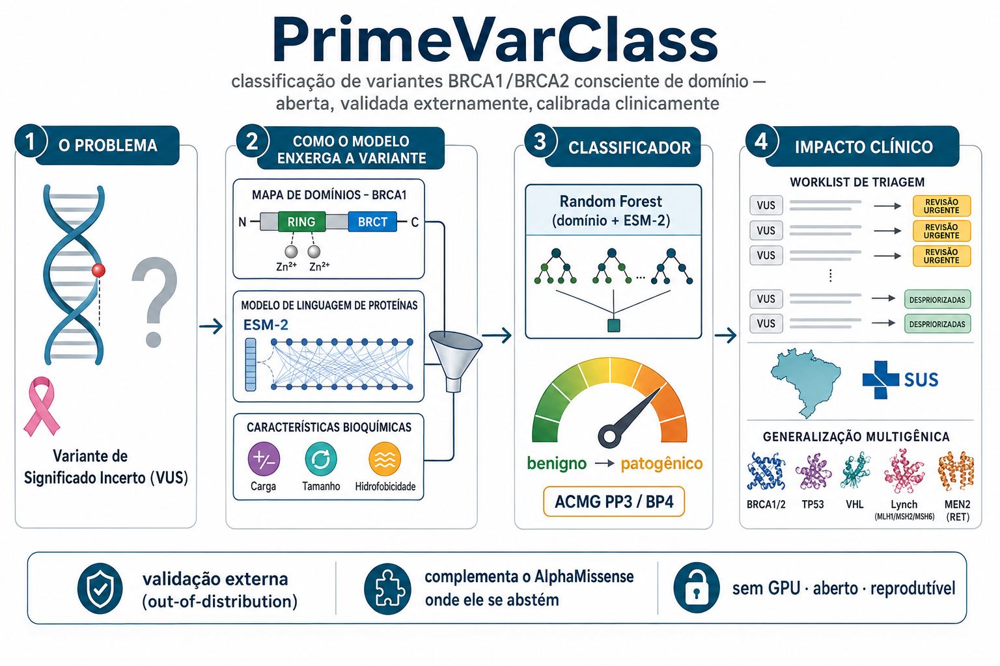

# PrimeVarClass

[](https://github.com/WesleyCapucho/primevarclass/actions/workflows/ci.yml)
[](LICENSE)
[](https://doi.org/10.5281/zenodo.21275650)

<p align="center">
  
</p>

**Classificação consciente de domínio de variantes *missense* em BRCA1/BRCA2. Aberta, validada externamente e calibrada em força de evidência clínica.**

PrimeVarClass é um sistema aberto e reprodutível de inteligência artificial para priorizar **variantes de significado incerto (VUS)** em genes de predisposição ao câncer de mama e de ovário. Seu princípio central é o **rigor metodológico e a reprodutibilidade**.

> Acompanha o trabalho submetido ao **32º Prêmio Jovem Cientista** (categoria  Mestre e Doutor; tema *IA para o Bem Comum*, subtema IA & Saúde).
> 📄 Artigo principal: [`docs/manuscrito/`](docs/manuscrito/).
> 📎 Material suplementar: [`docs/suplementar/`](docs/suplementar/PrimeVarClass_Material_Suplementar.md)

---

## O que diferencia este trabalho

1. **Protocolo anti-vazamento.** Diagnosticamos e neutralizamos uma **armadilha de vazamento posicional** (a posição bruta do resíduo memoriza o treino e colapsa em dados externos). A validação usa CV **bloqueada por posição** + coortes externas independentes de especialistas.
2. **Competitivo com o estado da arte.** Nas mesmas coortes externas (n = 621), o modelo é **estatisticamente comparável** a AlphaMissense, REVEL e CADD (teste de DeLong, todos *p* > 0,14), sendo **aberto e interpretável**. Um **meta-classificador** que integra todos os sinais atinge a melhor estimativa (AUC **0,938**), e o PrimeVarClass carrega **sinal não redundante** nessa integração (ver [Material Suplementar](docs/suplementar/PrimeVarClass_Material_Suplementar.md), S1–S2).
3. **Calibração clínica ACMG/AMP.** O escore é calibrado à força de evidência **PP3/BP4** (Tavtigian 2018; Pejaver 2022): escore ≥ 0,675 recebe **PP3_Forte**, com **94% de patogênicas** na coorte externa (LR local 75,9). Torna o resultado **acionável** para triagem de VUS.
4. **Validação em profundidade (dados reais).** Validação funcional ortogonal de bancada nos **dois genes** (*saturation genome editing* de BRCA1, AUC **0,795**; ensaio HDR de BRCA2, **0,874**; MaveDB); teste **genuinamente prospectivo** que prevê como a comunidade reclassificou 227 VUS de 2023 até 2026 (AUC **0,929**); o único comparador **sem circularidade** (EVE) fica estatisticamente empatado (DeLong *p* = 0,59); e generalização, com dados reais do ClinVar, a genes de **outras síndromes hereditárias** (TP53 0,888, Lynch/MSH6 0,908, Lynch/MSH2 0,885, MEN2/RET 0,843 e von Hippel-Lindau 0,722), mostrando que a receita ultrapassa o câncer de mama/ovário (Material Suplementar, S12).
5. **Explicabilidade** por SHAP e **ferramenta de linha de comando** de uso direto (abaixo).

### Resultado principal (dados reais, reexecutável)

| Modelo | CV bloqueada por posição | Coortes externas independentes |
| --- | ---: | ---: |
| Bioquímico (sem posição) | 0,743 | 0,717 |
| Posição bruta (referência de vazamento) | 0,802 | 0,791 |
| Consciente de domínio (proposto) | 0,818 | 0,847 |
| **Domínio + ESM-2 (carro-chefe)** | **0,882** | **0,909** |
| **Meta-classificador integrado** (S2) | n/a | **0,938** |

---

## Uso rápido (CLI)

```bash
pip install -e .
primevarclass score BRCA1 p.Arg1699Trp
```

```
PrimeVarClass: variante BRCA1 p.Arg1699Trp
  Domínio funcional      : BRCT1  [REGIÃO CRÍTICA]
  ESM-2 LLR (zero-shot)  : -11.50   (sinal patogênico)
  Probabilidade (modelo) : 0.878
  Classificação          : PATOGÊNICA (provável)  (confiança alta)
```

---

## A origem do projeto (a hipótese que refutamos)

O projeto **nasceu** de uma hipótese original (codificar aminoácidos como números primos) que **testamos com rigor e refutamos de forma transparente**: sob o protocolo anti-vazamento, as características derivadas de primos tiveram desempenho **inferior** ao de uma identidade trivial de aminoácido e **pioraram** um modelo bioquímico ao serem adicionadas. Foi ao investigar esse resultado negativo que diagnosticamos o vazamento posicional e chegamos à contribuição real: a **consciência de domínio funcional**. Os primos permanecem no código apenas como o conjunto `prime_only`, **resultado negativo documentado**, não componente ativo.

---

## Integridade científica

- Dados **públicos e auditáveis**: ClinVar (2★+), ENIGMA/ClinGen, gnomAD (r4), UniProt, RCSB PDB, Ensembl VEP, MaveDB.
- **Nenhum resultado, figura ou métrica foi fabricado ou simulado.** Comparações desfavoráveis (ex.: REVEL/AlphaMissense levemente acima em AUC) são reportadas de forma transparente.
- Uso de IA no desenvolvimento declarado no artigo, sob responsabilidade humana integral. Ver também [`SECURITY.md`](SECURITY.md).

---

## Estrutura do repositório

```
src/primevarclass/     Núcleo do método (pacote instalável)
  ├─ domain_annotation.py   Mapa curado de domínios UniProt (RING/BRCT/DBD)
  ├─ core.py                Características, treino, validação, calibração ACMG
  ├─ esm_scores.py          Ingestão de escores ESM-2 (zero-shot)
  ├─ data_sources.py        Ingestão de fontes públicas (ClinVar/gnomAD/ENIGMA)
  └─ cli.py                 Interface de linha de comando (primevarclass score)
tests/                 Testes automatizados (núcleo, domínio, ESM)
configs/               Configurações das fontes de dados (coortes BRCA reais)
data/                  Instantâneos de dados públicos (rastreáveis)
docs/manuscrito/       Artigo principal (PDF/DOCX/Markdown) + figuras
docs/suplementar/      Material suplementar (benchmark, meta, ACMG, DMS) + figuras
scratch/               Scripts que geram cada número e figura (ver scratch/README.md)
primevarclass_manuscript_analysis/   Artefatos gerados (JSON/CSV/figuras)
.github/workflows/     CI: lint (ruff), testes, auditoria de dependências (pip-audit)
```

---

## Reprodutibilidade

```bash
pip install -e ".[explain,dev]"
pytest tests/ -q                        # suíte de testes (35)

python scratch/validate_domain_integration.py   # resultado principal
python scratch/benchmark_sota.py                 # benchmark vs. estado da arte (S1)
python scratch/meta_classifier.py                # meta-classificador integrado (S2)
python scratch/acmg_calibration.py               # calibração ACMG/AMP (S3)
python scratch/monte_carlo_robustness.py         # robustez (Monte Carlo)
```

Sementes aleatórias fixas garantem reprodutibilidade determinística; artefatos e figuras em alta resolução são gravados em `primevarclass_manuscript_analysis/` e `docs/*/figuras/`.

O índice completo dos scripts, agrupado por etapa do pipeline e indicando qual figura ou tabela cada um produz, está em [`scratch/README.md`](scratch/README.md).

---

## Aviso

Ferramenta de **apoio à pesquisa genética responsável**. **Não** é dispositivo de diagnóstico clínico, **não** emite laudo e **não** substitui aconselhamento genético profissional nem validação experimental independente.

## Licença

Distribuído sob a licença **MIT** (ver [`LICENSE`](LICENSE)).

## Autor

**Wesley Felipe Capucho**, mestrando em biotecnologia industrial, Escola de Engenharia de Lorena, Universidade de São Paulo (EEL-USP).
