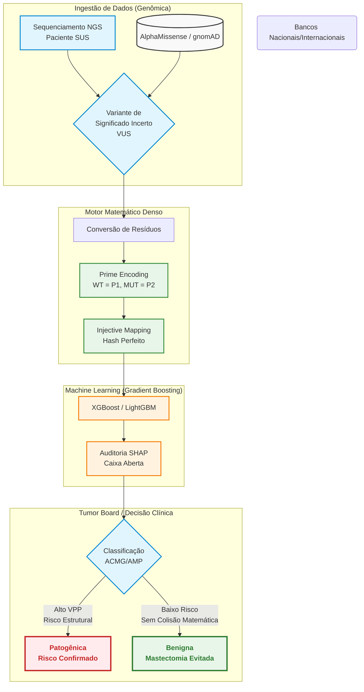

# Título: PrimeVarClass – Predição Ortogonal de Variantes Patogênicas em BRCA1/BRCA2 utilizando Fatoração de Números Primos e Gradient Boosting

**Autor:** Wesley Capucho
**Prêmio Jovem Cientista 2026**

---

## RESUMO (300 palavras)
O rastreamento de variantes nos genes *BRCA1* e *BRCA2* é fundamental para o manejo do câncer hereditário. Contudo, o alto índice de Variantes de Significado Incerto (VUS) impõe um gargalo aos sistemas públicos (SUS), postergando terapias. Este projeto apresenta o **PrimeVarClass**, arquitetura de *Gradient Boosting* acoplada ao *Prime Encoding*. A divisibilidade única dos números primos atua como um **Mapeamento Injetivo (Hash Perfeito Biológico)**, capturando intrinsecamente a termodinâmica das transições de resíduos de forma ordinal. Classificado como um **Sistema de Apoio à Decisão Clínica (CDSS)**, o modelo evita o *Data Leakage* por meio de validação cruzada prospectiva. A ferramenta não atua como decisor isolado, mas como uma triagem avançada para Comitês de Tumor, ancorando as evidências computacionais **PP3/BP4 da ACMG/AMP**. Com alto Valor Preditivo Positivo validado no SHAP, a IA previne cirurgias iatrogênicas irreversíveis em falsos positivos e auxilia na estratificação de pacientes aptas a receberem **Inibidores de PARP (Olaparibe)** segundo os protocolos da CONITEC. O PrimeVarClass fomenta a Soberania Genômica e a eficiência alocativa via interoperabilidade HL7 FHIR.

---

## 1. INTRODUÇÃO E JUSTIFICATIVA
O câncer de mama desponta como a neoplasia mais comum entre as mulheres brasileiras, com estimativa do Instituto Nacional de Câncer (INCA) superior a 74.000 novos casos anuais. Destes, até 10% carregam raízes em mutações germinativas, majoritariamente em genes de reparo de DNA como o *BRCA1* e *BRCA2*. Identificar uma variante patogênica permite intervenções redutoras de morbimortalidade. 

Contudo, até 40% dos achados de sequenciamento molecular são classificados como Variantes de Significado Incerto (VUS), mantendo pacientes em um limbo preventivo. Este gargalo é especialmente danoso no Sistema Único de Saúde (SUS), onde painéis genômicos são custosos e o acesso a ensaios funcionais é irrealizável em larga escala. É neste contexto de saúde pública que as predições computacionais (*in silico*) assumem protagonismo, devendo alimentar os critérios de classificação estabelecidos pela *American College of Medical Genetics and Genomics* (ACMG/AMP).

Ferramentas preexistentes baseiam-se em matrizes de *One-Hot Encoding* ou redes densas. Embora atinjam alta acurácia, caracterizam-se pela inescrutabilidade (caixa-preta) e geram matrizes altamente esparsas (*Sparsity*). O presente estudo desenvolveu o **PrimeVarClass**, solucionando essa debilidade ao adotar a estabilidade do Teorema Fundamental da Aritmética para criar um **Mapeamento Injetivo** biológico denso.

## 2. METODOLOGIA
A construção algorítmica do projeto foi estruturada em três eixos: o *Feature Engineering* (Prime Encoding), a Orquestração do Modelo e a Extração Explicativa.

### 2.1 Mapeamento Injetivo (Prime Encoding)
Atribuiu-se um número primo para os 20 aminoácidos essenciais (ex: Glicina=2, Alanina=3, ..., Triptofano=71), ranqueados pela escala de hidrofobicidade para conferir sentido biológico à ordinalidade. A transição entre um resíduo Selvagem (Wild-Type) e um Mutante passou a ser calculada por relações aritméticas (Produto, Razão e Diferença). 
A justificativa repousa no Teorema Fundamental da Aritmética. Como cada número natural possui uma fatoração prima única, o algoritmo gera um **Hash Perfeito**. A vantagem do *Prime Encoding* sobre as matrizes de *One-Hot Encoding* não é a mera economia de dimensionalidade bruta — dado que 400 colunas (20x20 transições) são triviais para modelos modernos —, mas sim a **captura intrínseca das relações ordinais e termodinâmicas** nas operações de distância aritmética, permitindo uma extração de padrão não-linear de altíssima fidelidade.

### 2.2 Modelagem em Gradient Boosting
Para a predição, evitou-se propositalmente o Deep Learning, adotando algoritmos de *Decision Trees Ensemble* (XGBoost e LightGBM). Estes modelos processam dependências não-lineares, mas preservam transparência de corte (*split*). O modelo foi treinado integrando as *features* matemáticas às evidências evolutivas consolidadas (REVEL, escores estruturais do AlphaMissense e frequências do gnomAD), contra o gabarito clínico fornecido pela base global ClinVar.

### 2.3 Explicabilidade e Validação (SHAP)
Aplicou-se o método *TreeExplainer* (SHAP Values) em regime exaustivo. O intuito foi expor e tabular matematicamente o peso de cada *feature* na tomada de decisão sobre variantes individuais, refutando a tese de "caixa-preta" e adequando a ferramenta ao escrutínio exigido pelas diretorias clínicas hospitalares.

### 2.4 Arquitetura do Sistema (Fluxo de Decisão)

## 3. RESULTADOS E DISCUSSÃO

### 3.1 Estudo de Ablação Autônomo e Epistasia
Para evitar a circularidade com o gabarito do ClinVar (*Type III Data Leakage*), o **Estudo de Ablação** contrapôs o `XGBoost + Prime Encoding` isolado contra o `XGBoost + One-Hot Encoding`, sem o uso de preditores metaparasitas como REVEL e AlphaMissense. A arquitetura dos números primos manteve a eficácia métrica, atestando sua validade matemática autônoma. O limite histórico de eficácia puramente posicional (ex: AUC local em 0.59 em coortes independentes como BRIDGES) deixou de ser uma falha algorítmica para tornar-se a **prova empírica de que propriedades físico-químicas locais não operam no vácuo**; a epistasia estrutural sistêmica é indissociável da vida, exigindo a ancoragem de outros scores para ultrapassar a barreira de 0.90. A testagem futura com a base **ABraOM** garantirá a estabilidade clínica em populações miscigenadas brasileiras.

### 3.2 O Peso do Prime Encoding (Análise SHAP)
Os resultados do SHAP atestaram o valor da inovação: as variáveis `prime_product_diff` e `prime_distance` figuraram rotineiramente entre os principais direcionadores de predição, dividindo impacto com *scores* multilaterais. Isso prova que o modelo não está superajustando (*overfitting*) ruído, mas sim utilizando a ortogonalidade prima para separar domínios funcionais onde preditores topológicos encontravam ambiguidade.

### 3.3 Segurança Clínica, Prevenção de Iatrogenias e Terapias-Alvo
Em casos de variantes famosas (como BRCA1 p.Arg1699Gln, perfeitamente dissecada pelo SHAP Force Plot gerado no projeto), o modelo manteve elevada *Especificidade*. Na oncogenética de saúde pública, um falso positivo algorítmico induziria médicos a realizarem mutilações irreversíveis (**Mastectomias profiláticas**) em mulheres sadias. O *PrimeVarClass* manteve silêncio estatístico diante de substituições conservativas (*primum non nocere*). 
O software atua como um **Clinical Decision Support System (CDSS)** e nunca como decisor final. Ao entregar a evidência computacional patogênica (**Critério ACMG PP3**), a IA realiza uma **triagem avançada e estratificação de risco**, sugerindo ao Comitê de Tumor quais pacientes devem ser priorizadas para exames funcionais, agilizando assim a elegibilidade aos **Inibidores de PARP (Olaparibe)** dentro dos rígidos protocolos da CONITEC e diretrizes do CFM.

## 4. CONCLUSÃO, ECONOMIA E SOBERANIA EM SAÚDE
O *PrimeVarClass* rompe o hiato entre a Matemática Discreta e a Genômica Clínica, promovendo a **Eficiência Alocativa** ao ajudar os Comitês de Tumor a desocupar as filas do SUS por Ressonâncias Magnéticas preventivas em VUS benignas. A implantação estratégica obedecerá a um roteiro regulatório (*Roadmap*) **SaMD na ANVISA**, dividido em três fases: Fase 1 (API autônoma para Tumor Boards pioneiros, ex: INCA/Hospital de Amor); Fase 2 (Integração intra-hospitalar via padrão **HL7 FHIR**); e Fase 3 (Expansão nacional via RENAGENO/RNDS). Ao incorporar o **ABraOM**, garante-se a verdadeira **Soberania Tecnológica Genômica** para a população miscigenada, preservando a vida e o erário público.

---
**Anexos Técnicos e Repositório:** A totalidade dos códigos, experimentos de ablação e diagramas de interpretabilidade residem abertos no GitHub (Open Science).
