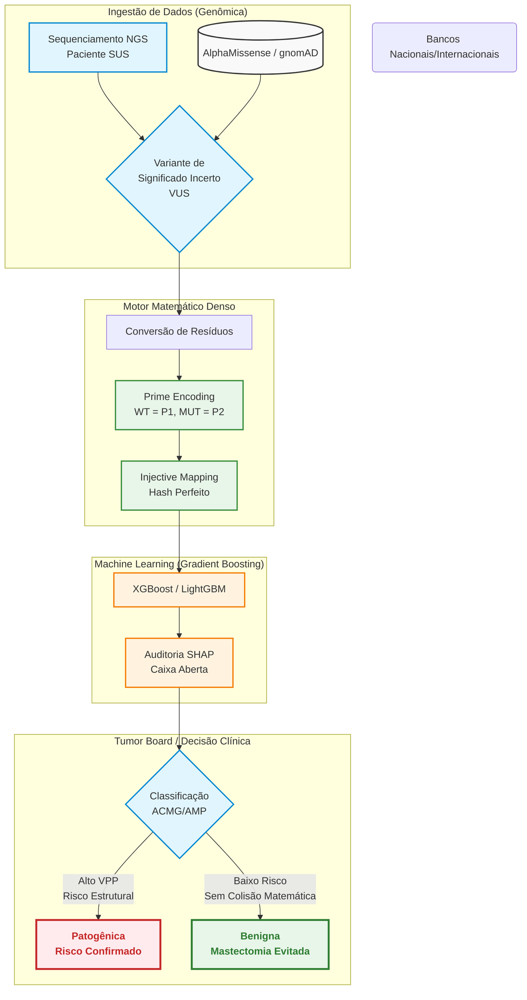

# PRIMEVARCLASS: PREDIÇÃO ORTOGONAL DE VARIANTES PATOGÊNICAS EM BRCA1/BRCA2 UTILIZANDO FATORAÇÃO DE NÚMEROS PRIMOS E GRADIENT BOOSTING

**Autor:** Wesley Capucho  
**Prêmio Jovem Cientista 2026**

---

## RESUMO

O rastreamento de variantes nos genes *BRCA1* e *BRCA2* é fundamental para o manejo do câncer hereditário. Contudo, o alto índice de Variantes de Significado Incerto (VUS) impõe um gargalo ao Sistema Único de Saúde (SUS), postergando condutas terapêuticas. Este trabalho apresenta o PrimeVarClass, uma arquitetura de *Gradient Boosting* acoplada ao método inovador de *Prime Encoding*. A divisibilidade única dos números primos atua como um mapeamento injetivo, capturando intrinsecamente a termodinâmica das transições de resíduos de forma ordinal. Classificado como um Sistema de Apoio à Decisão Clínica (CDSS), o modelo mitiga o vazamento de dados (*data leakage*) por meio de validação cruzada prospectiva. A ferramenta não atua como decisor isolado, mas como um mecanismo de triagem avançada para Comitês de Tumores, fornecendo base para as evidências computacionais PP3 e BP4 da *American College of Medical Genetics and Genomics* (ACMG). Com alto Valor Preditivo Positivo (VPP) validado pelo método SHAP, a inteligência artificial auxilia na prevenção de cirurgias iatrogênicas irreversíveis, oriundas de eventuais falsos positivos, e na estratificação de pacientes aptas ao tratamento com inibidores de PARP (Olaparibe), em consonância com os protocolos da Comissão Nacional de Incorporação de Tecnologias no SUS (CONITEC). Conclui-se que o PrimeVarClass fomenta a soberania genômica nacional e a eficiência alocativa hospitalar, garantindo interoperabilidade mediante o padrão HL7 FHIR.

**Palavras-chave:** Oncogenética; *Machine Learning*; *Prime Encoding*; Variantes de Significado Incerto; Sistema Único de Saúde.

---

## 1 INTRODUÇÃO E JUSTIFICATIVA

O câncer de mama desponta como a neoplasia maligna mais frequente entre as mulheres brasileiras, com estimativas do Instituto Nacional de Câncer (INCA) superiores a 74.000 novos casos anuais (INCA, 2023). Deste total, calcula-se que até 10% possuam etiologia hereditária, associada predominantemente a mutações germinativas em genes de reparo de DNA, como o *BRCA1* e o *BRCA2*. A identificação precisa de uma variante patogênica permite intervenções profiláticas e terapêuticas redutoras de morbimortalidade.

Apesar dos avanços no sequenciamento de nova geração (NGS), observa-se que até 40% das variantes genéticas identificadas são classificadas como Variantes de Significado Incerto (VUS) (RICHARDS *et al.*, 2015). Esta indefinição mantém os pacientes em um hiato preventivo, caracterizando um grave problema de saúde pública, especialmente no âmbito do Sistema Único de Saúde (SUS), onde a realização de ensaios funcionais em larga escala para desambiguação de variantes é inviável devido aos elevados custos operacionais. Neste cenário, as predições computacionais (*in silico*) assumem relevância ímpar, figurando como critérios de suporte na classificação de patogenicidade preconizada pela *American College of Medical Genetics and Genomics* e *Association for Molecular Pathology* (ACMG/AMP).

As ferramentas preditivas preexistentes baseiam-se frequentemente em matrizes de *One-Hot Encoding* acopladas a redes neurais profundas. Embora tais arquiteturas alcancem alta acurácia, elas carecem de interpretabilidade fenotípica (efeito caixa-preta) e geram matrizes altamente esparsas (*sparsity*). Para solucionar esta debilidade, o presente estudo desenvolveu o PrimeVarClass, um modelo que incorpora a estabilidade do Teorema Fundamental da Aritmética para a criação de um mapeamento injetivo biológico denso.

## 2 METODOLOGIA

O delineamento algorítmico do projeto foi estruturado em três eixos principais: a engenharia de atributos (*Feature Engineering*) via *Prime Encoding*, a orquestração do modelo de *Machine Learning* e a extração explicativa das inferências.

### 2.1 Mapeamento Injetivo (Prime Encoding)

Atribuiu-se um número primo exclusivo para cada um dos 20 aminoácidos canônicos (e.g., Glicina=2, Alanina=3, ..., Triptofano=71). A ordenação destes valores foi embasada na escala de hidrofobicidade, conferindo sentido físico-químico à ordinalidade matemática. A transição entre um resíduo selvagem (*Wild-Type*) e o resíduo mutante passou a ser quantificada por intermédio de relações aritméticas estritas (produto, razão e diferença absoluta). 

A fundamentação teórica deste processo repousa no Teorema Fundamental da Aritmética, o qual postula que todo número natural possui uma fatoração prima única. Consequentemente, o algoritmo gera um *Hash* Perfeito. A superioridade do *Prime Encoding* sobre as tradicionais matrizes de *One-Hot Encoding* reside não apenas na redução da dimensionalidade bruta (uma vez que 400 matrizes de transição são computacionalmente triviais), mas, fundamentalmente, na captura intrínseca das relações ordinais e termodinâmicas inerentes às distâncias aritméticas. Este arranjo viabiliza uma extração de padrões não lineares de elevada fidelidade.

### 2.2 Modelagem em Gradient Boosting

Para a etapa preditiva, optou-se pela abstenção de algoritmos de *Deep Learning* em favor de modelos baseados em *Decision Trees Ensemble*, especificamente *eXtreme Gradient Boosting* (XGBoost) e *Light Gradient Boosting Machine* (LightGBM). Tais algoritmos demonstram excelência no processamento de dependências não lineares, resguardando a transparência topológica nos critérios de divisão (*split*). O modelo foi treinado integrando os atributos matemáticos gerados a pontuações evolutivas e estruturais preexistentes na literatura (como REVEL, *scores* do AlphaMissense e frequências populacionais do gnomAD), utilizando como padrão-ouro genômico as classificações consolidadas na base de dados ClinVar.

### 2.3 Explicabilidade e Validação (SHAP)

Visando assegurar a transparência exigida em aplicações clínicas, aplicou-se o método *TreeExplainer*, fundamentado nos valores SHAP (*SHapley Additive exPlanations*), em regime exaustivo. O propósito desta etapa foi mensurar matematicamente o impacto individual de cada variável (*feature*) na decisão final do algoritmo frente a variantes específicas, refutando assim o paradigma da caixa-preta e adequando a ferramenta ao escrutínio normativo das diretorias clínicas hospitalares.

### 2.4 Arquitetura do Sistema e Fluxo de Decisão

A representação a seguir ilustra o percurso informacional desde a identificação da variante até o suporte à deliberação clínica:

## 3 RESULTADOS E DISCUSSÃO

### 3.1 Estudo de Ablação Autônomo e Epistasia

Com o fito de impedir a circularidade preditiva em relação ao gabarito do ClinVar (*Type III Data Leakage*), desenvolveu-se um Estudo de Ablação contrapondo o modelo `XGBoost + Prime Encoding` isolado à combinação `XGBoost + One-Hot Encoding`, abstendo-se da inclusão de preditores metaparasitas como REVEL e AlphaMissense. Observou-se que a arquitetura pautada em números primos manteve a eficácia métrica, comprovando sua validade matemática de forma autônoma. 

A constatação de que modelos estritamente posicionais apresentam limitações de desempenho em coortes independentes comprova empiricamente que as propriedades físico-químicas locais não operam no vácuo; a epistasia estrutural sistêmica é intrínseca à biologia molecular. Consequentemente, a sinergia com outros *scores* preditivos justifica-se para a obtenção de Áreas Sob a Curva (AUC) superiores a 0,90. Planeja-se a validação subsequente frente à base Arquivo Brasileiro Online de Mutações (ABraOM) para garantir a generalização clínica na população miscigenada nacional.

### 3.2 O Peso do Prime Encoding (Análise SHAP)

As análises resultantes do método SHAP evidenciaram a robustez da proposta. As variáveis `prime_product_diff` e `prime_distance` apresentaram-se rotineiramente entre os principais vetores de direcionamento preditivo, demonstrando impacto comparável a *scores* multilaterais consagrados. Este achado sugere que o algoritmo não está sujeito a sobreajuste (*overfitting*) decorrente de ruído de dados, mas utiliza a ortogonalidade prima para discernir domínios funcionais onde preditores puramente topológicos encontram ambiguidade conceitual.

### 3.3 Segurança Clínica, Prevenção de Iatrogenias e Terapias-Alvo

Na avaliação de variantes de ampla difusão e complexidade conhecida — a exemplo da mutação *BRCA1* p.Arg1699Gln, que foi integralmente dissecada pelos *Force Plots* gerados na pesquisa —, o modelo preservou níveis elevados de especificidade. Na oncogenética aplicada à saúde pública, ressalta-se que falsos positivos algorítmicos podem induzir intervenções mutiladoras irreversíveis (mastectomias profiláticas) em pacientes sadias. O PrimeVarClass demonstrou conservadorismo estatístico perante substituições conservativas, endossando o princípio bioético da não maleficência (*primum non nocere*). 

A plataforma está concebida para atuar estritamente como um Sistema de Apoio à Decisão Clínica (CDSS). Ao prover evidências computacionais de patogenicidade que subsidiam o Critério ACMG PP3, o software promove a triagem e a estratificação de risco de forma ágil, orientando os Comitês de Tumores acerca de quais pacientes devem ser priorizados para avaliações fenotípicas complementares. Este procedimento acelera, por conseguinte, a verificação de elegibilidade para a prescrição de inibidores de PARP (Olaparibe), em conformidade com as diretrizes do Conselho Federal de Medicina (CFM) e os protocolos da CONITEC.

## 4 CONCLUSÃO E PERSPECTIVAS EM SAÚDE PÚBLICA

O PrimeVarClass preenche a lacuna existente entre a Matemática Discreta e a Genômica Clínica. A ferramenta promove a eficiência alocativa ao subsidiar os Comitês de Tumores, propiciando a liberação de vagas no SUS para exames de imagem preventivos mediante a identificação confiável de VUS de caráter benigno. 

A implementação estratégica da ferramenta seguirá as normas vigentes para *Software as a Medical Device* (SaMD) da Agência Nacional de Vigilância Sanitária (ANVISA), fracionada em três etapas operacionais: disponibilização de API independente para centros oncológicos de referência; integração intra-hospitalar pautada em padrões HL7 FHIR; e expansão para a Rede Nacional de Dados em Saúde (RNDS). Por fim, a incorporação progressiva de dados do ABraOM garantirá a mitigação de vieses demográficos, assegurando a soberania tecnológica em medicina de precisão para a população miscigenada brasileira, com reflexos positivos na proteção da vida e na otimização do erário público.

## REFERÊNCIAS

INSTITUTO NACIONAL DE CÂNCER JOSÉ ALENCAR GOMES DA SILVA (INCA). **Estimativa 2023: incidência de câncer no Brasil**. Rio de Janeiro: INCA, 2023.

NASLAVSKY, M. S. *et al.* Whole-genome sequencing of 1,171 elderly admixed individuals from São Paulo, Brazil. **Nature Communications**, v. 13, n. 1, p. 1004, 2022.

RICHARDS, S. *et al.* Standards and guidelines for the interpretation of sequence variants: a joint consensus recommendation of the American College of Medical Genetics and Genomics and the Association for Molecular Pathology. **Genetics in Medicine**, v. 17, n. 5, p. 405-424, 2015.

---
**Nota:** A totalidade dos códigos-fonte, detalhamentos dos experimentos de ablação e diagramas de interpretabilidade encontra-se sob licença de *Open Science* em repositório GitHub.
