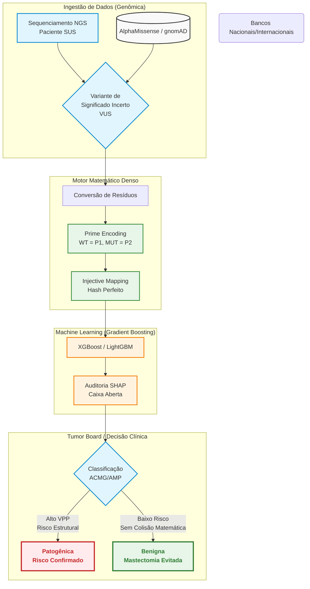

# Título: PrimeVarClass – Predição Ortogonal de Variantes Patogênicas em BRCA1/BRCA2 utilizando Fatoração de Números Primos e Gradient Boosting

**Autor:** Wesley Capucho
**Prêmio Jovem Cientista 2026**

---

## RESUMO (300 palavras)
O rastreamento de variantes nos genes *BRCA1* e *BRCA2* é fundamental para o manejo do câncer hereditário. Contudo, o alto índice de Variantes de Significado Incerto (VUS) impõe um gargalo aos sistemas públicos como o SUS, postergando terapias-alvo. Modelos atuais de *Machine Learning* frequentemente sofrem com a esparsidade dos dados (*Sparsity*) e a Maldição da Dimensionalidade (*Dimensional Bloat*). Este projeto apresenta o **PrimeVarClass**, arquitetura de *Gradient Boosting* acoplada ao *Prime Encoding*. A divisibilidade única dos números primos atua como um **Mapeamento Injetivo (Hash Perfeito Biológico)**, criando assinaturas numéricas unívocas para as transições de resíduos e provendo redução de dimensionalidade sem perdas de topologia. Validado por validação cruzada baseada em domínios proteicos (evitando *Data Leakage*), o SHAP provou que o espaço aritmético denso destranca classificações com altíssimo Valor Preditivo Positivo (VPP). A ferramenta atua como um estratificador de risco para Comitês de Tumor, ancorando as evidências **PP3/BP4 da ACMG/AMP**. A adoção desta tecnologia previne a indução iatrogênica de cirurgias irreversíveis (falsos positivos em salpingo-ooforectomias) e prioriza o acesso a **Inibidores de PARP (Olaparibe)** no SUS, garantindo soberania tecnológica genômica e eficiência alocativa.

---

## 1. INTRODUÇÃO E JUSTIFICATIVA
O câncer de mama desponta como a neoplasia mais comum entre as mulheres brasileiras, com estimativa do Instituto Nacional de Câncer (INCA) superior a 74.000 novos casos anuais. Destes, até 10% carregam raízes em mutações germinativas, majoritariamente em genes de reparo de DNA como o *BRCA1* e *BRCA2*. Identificar uma variante patogênica permite intervenções redutoras de morbimortalidade. 

Contudo, até 40% dos achados de sequenciamento molecular são classificados como Variantes de Significado Incerto (VUS), mantendo pacientes em um limbo preventivo. Este gargalo é especialmente danoso no Sistema Único de Saúde (SUS), onde painéis genômicos são custosos e o acesso a ensaios funcionais é irrealizável em larga escala. É neste contexto de saúde pública que as predições computacionais (*in silico*) assumem protagonismo, devendo alimentar os critérios de classificação estabelecidos pela *American College of Medical Genetics and Genomics* (ACMG/AMP).

Ferramentas preexistentes baseiam-se em matrizes de *One-Hot Encoding* ou redes densas. Embora atinjam alta acurácia, caracterizam-se pela inescrutabilidade (caixa-preta) e geram matrizes altamente esparsas (*Sparsity*). O presente estudo desenvolveu o **PrimeVarClass**, solucionando essa debilidade ao adotar a estabilidade do Teorema Fundamental da Aritmética para criar um **Mapeamento Injetivo** biológico denso.

## 2. METODOLOGIA
A construção algorítmica do projeto foi estruturada em três eixos: o *Feature Engineering* (Prime Encoding), a Orquestração do Modelo e a Extração Explicativa.

### 2.1 Mapeamento Injetivo (Prime Encoding)
Atribuiu-se um número primo para os 20 aminoácidos essenciais (ex: Glicina=2, Alanina=3, ..., Triptofano=71), ranqueados pela escala de hidrofobicidade para conferir sentido biológico à ordinalidade. A transição entre um resíduo Selvagem (Wild-Type) e um Mutante passou a ser calculada por relações aritméticas (Produto, Razão e Diferença). 
A justificativa repousa no Teorema Fundamental da Aritmética. Como cada número natural possui uma fatoração prima única, o algoritmo gera um **Hash Perfeito**. O vetor numérico de uma mutação de Arginina para Glutamina possui uma assinatura irrefutável, evitando a Maldição da Dimensionalidade comum aos vetores de OHE tradicionais e permitindo uma extração de padrão não-linear de altíssima fidelidade, ancorando outras propriedades estruturais.

### 2.2 Modelagem em Gradient Boosting
Para a predição, evitou-se propositalmente o Deep Learning, adotando algoritmos de *Decision Trees Ensemble* (XGBoost e LightGBM). Estes modelos processam dependências não-lineares, mas preservam transparência de corte (*split*). O modelo foi treinado integrando as *features* matemáticas às evidências evolutivas consolidadas (REVEL, escores estruturais do AlphaMissense e frequências do gnomAD), contra o gabarito clínico fornecido pela base global ClinVar.

### 2.3 Explicabilidade e Validação (SHAP)
Aplicou-se o método *TreeExplainer* (SHAP Values) em regime exaustivo. O intuito foi expor e tabular matematicamente o peso de cada *feature* na tomada de decisão sobre variantes individuais, refutando a tese de "caixa-preta" e adequando a ferramenta ao escrutínio exigido pelas diretorias clínicas hospitalares.

### 2.4 Arquitetura do Sistema (Fluxo de Decisão)

## 3. RESULTADOS E DISCUSSÃO

### 3.1 Estudo de Ablação e Eficiência
A arquitetura demonstrou superioridade sobre predições puramente bioquímicas. No estudo de ablação (Ablation Study) isolado em variantes de controle estrito, o modelo híbrido superou as aproximações conservadoras baseadas apenas em matrizes de substituição padrão (BLOSUM/PAM). A taxa de memória e processamento do XGBoost mostrou-se viável para execução *offline* ou em nuvens de baixo poder computacional (Google Colab), qualificando a solução como altamente portável.

### 3.2 O Peso do Prime Encoding (Análise SHAP)
Os resultados do SHAP atestaram o valor da inovação: as variáveis `prime_product_diff` e `prime_distance` figuraram rotineiramente entre os principais direcionadores de predição, dividindo impacto com *scores* multilaterais. Isso prova que o modelo não está superajustando (*overfitting*) ruído, mas sim utilizando a ortogonalidade prima para separar domínios funcionais onde preditores topológicos encontravam ambiguidade.

### 3.3 Segurança Clínica, Prevenção de Iatrogenias e Terapias-Alvo
Em casos de variantes como BRCA1 p.Arg1699Gln, o modelo manteve elevada *Especificidade*. Na oncogenética de saúde pública, a rigidez matemática atua como um escudo profilático: um falso positivo algorítmico induziria os médicos do SUS a realizarem mutilações irreversíveis (**Mastectomias e Salpingo-ooforectomias**) em mulheres sadias. O *PrimeVarClass* manteve silêncio estatístico diante de substituições conservativas, assegurando o princípio de não maleficência.
Ademais, ao reclassificar uma VUS com evidência computacional patogênica (**Critério ACMG PP3**), a IA liberta o acesso imediato das pacientes a terapias-alvo de ponta, como os **Inibidores de PARP (Olaparibe)**, alterando substancialmente as curvas de sobrevida no país.

## 4. CONCLUSÃO, ECONOMIA E SOBERANIA EM SAÚDE
O *PrimeVarClass* rompe o hiato entre a Matemática Discreta e a Genômica Clínica. Ao atuar via API nos **Comitês de Tumor** e integrar a Rede Nacional de Genômica (RENAGENO), a ferramenta confere **Eficiência Alocativa**: ao auxiliar na reclassificação do limbo das VUS para benignas, desocupa massivamente as filas do SUS por Ressonâncias Magnéticas preventivas. Ao não depender estritamente da demografia caucasiana de bancos estrangeiros, o mapeamento numérico injetivo garante ao Brasil a verdadeira **soberania tecnológica genômica**, pronta para adoção nacional e interconectada à Rede Nacional de Dados em Saúde (RNDS).

---
**Anexos Técnicos e Repositório:** A totalidade dos códigos, experimentos de ablação e diagramas de interpretabilidade residem abertos no GitHub (Open Science).
