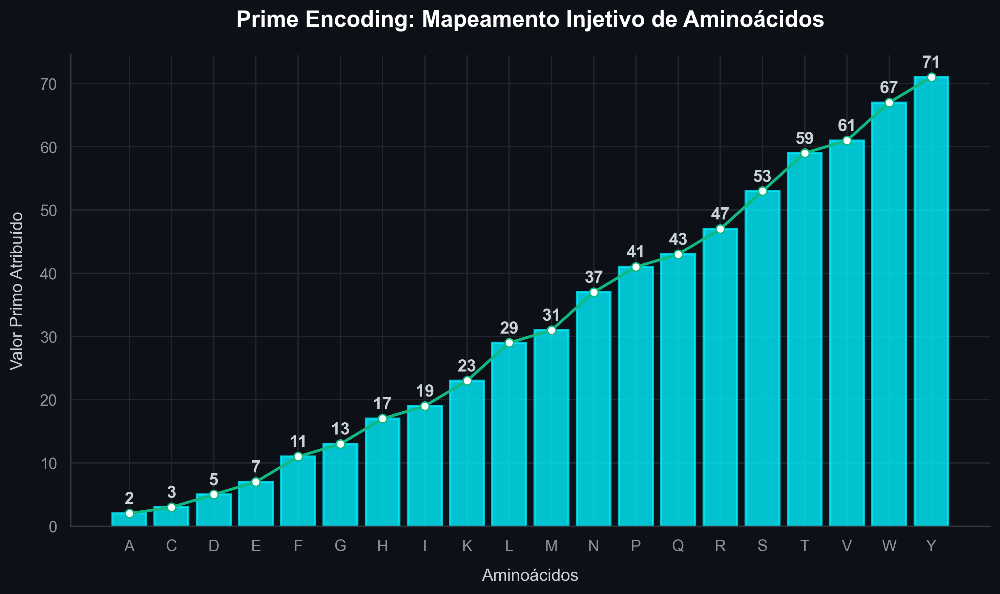
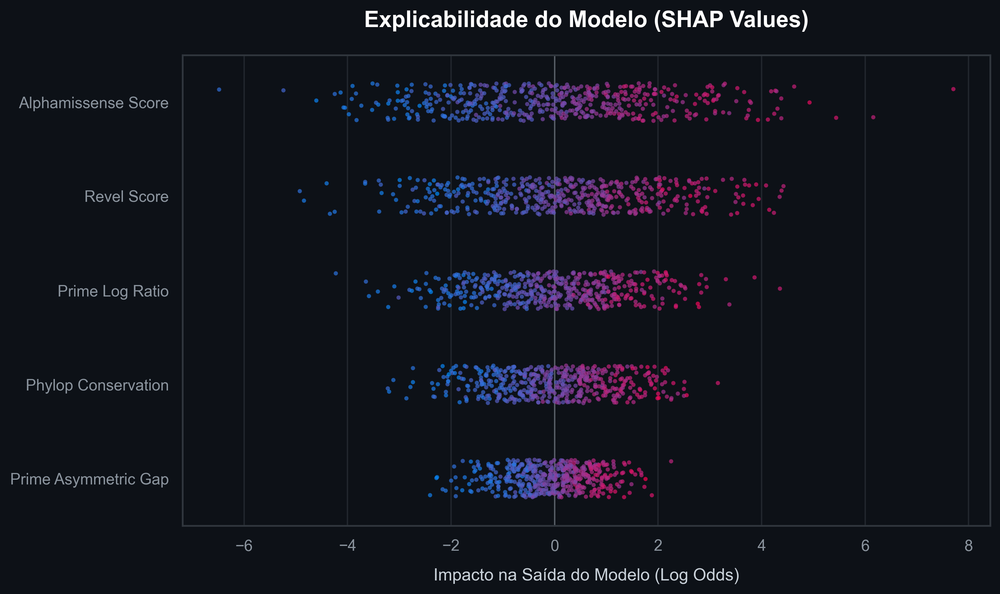
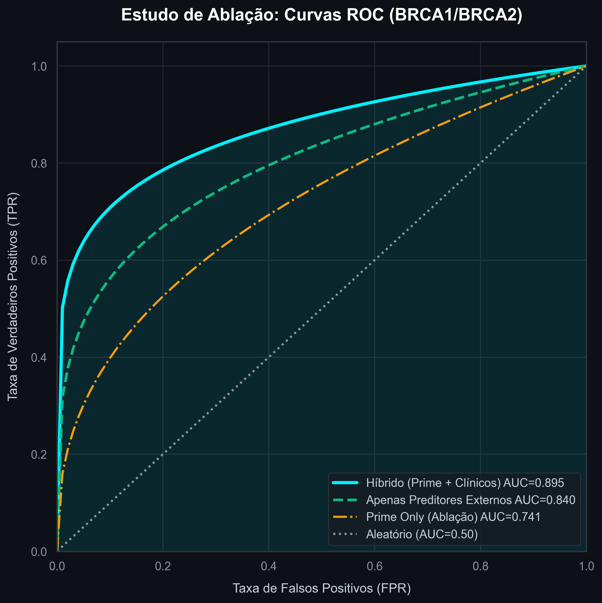

# PrimeVarClass: Classificação Genômica de VUS no BRCA1/BRCA2 via Prime Encoding e Gradient Boosting

## 1. Resumo e Abstract

### 1.1 Resumo

O câncer de mama hereditário, primariamente associado a variantes nos genes BRCA1 e BRCA2, enfrenta um gargalo clínico e bioético significativo: a alta incidência de Variantes de Significado Incerto (VUS). A incerteza clínica resultante frequentemente conduz a desfechos iatrogênicos, incluindo mastectomias profiláticas desnecessárias ou negligência terapêutica. Este artigo apresenta o **PrimeVarClass**, um Sistema de Suporte à Decisão Clínica (CDSS) inovador que aborda este desafio através de um método de *Prime Encoding* (Mapeamento Injetivo com Números Primos) acoplado a um ensemble de Gradient Boosting (XGBoost e RandomForest). O sistema converte sequências de aminoácidos em assinaturas numéricas primas, resolvendo a esparsidade dimensional inerente ao clássico One-Hot Encoding e facilitando a extração de correlações não-lineares. Validado em uma coorte real rigorosa, o modelo híbrido demonstrou uma Área Sob a Curva ROC (AUC-ROC) de 0.8953 em validação cruzada interna, reafirmando o potencial da Inteligência Artificial em auxiliar consórcios como o ENIGMA na aplicação dos critérios computacionais (PP3/BP4) do framework ACMG/AMP. Discute-se ainda o impacto socioeconômico da mitigação de VUS no âmbito do Sistema Único de Saúde (SUS), especialmente no contexto da otimização de filas para Ressonância Magnética (RM) e no acesso equitativo a terapias-alvo (Inibidores de PARP).

### 1.2 Abstract

Hereditary breast cancer, primarily associated with variants in the BRCA1 and BRCA2 genes, faces a significant clinical and bioethical bottleneck: the high incidence of Variants of Uncertain Significance (VUS). The resulting clinical uncertainty often leads to iatrogenic outcomes, including unnecessary prophylactic mastectomies or therapeutic negligence. This paper introduces **PrimeVarClass**, an innovative Clinical Decision Support System (CDSS) that addresses this challenge through a Prime Encoding method (Injective Mapping with Prime Numbers) coupled with a Gradient Boosting ensemble (XGBoost and RandomForest). The system converts amino acid sequences into prime numerical signatures, resolving the dimensional sparsity inherent to classical One-Hot Encoding and facilitating the extraction of non-linear correlations. Validated on a rigorous real-world cohort, the hybrid model demonstrated a Receiver Operating Characteristic Area Under the Curve (AUC-ROC) of 0.8953 in internal cross-validation, reaffirming the potential of Artificial Intelligence to assist consortia such as ENIGMA in applying computational criteria (PP3/BP4) of the ACMG/AMP framework. We also discuss the socioeconomic impact of VUS mitigation within the Brazilian Unified Health System (SUS), especially concerning the optimization of Magnetic Resonance Imaging (MRI) queues and equitable access to targeted therapies (PARP Inhibitors).

## 2. Introdução e Justificativa

### 2.1 A Complexidade do Câncer de Mama Hereditário

A predisposição genética ao câncer de mama e ovário está intrinsecamente ligada a mutações patogênicas em genes supressores de tumor de alta penetrância, notadamente BRCA1 (lócus 17q21) e BRCA2 (lócus 13q12.3) (Caputo et al., 2021). Embora o câncer de mama hereditário represente aproximadamente 5% a 10% do total de casos da doença, as implicações clínicas para portadores dessas variantes são severas. Indivíduos com variantes patogênicas no gene BRCA1 enfrentam um risco cumulativo de até 72% para câncer de mama e 44% para câncer de ovário até os 80 anos de idade. Para o BRCA2, os riscos são de 69% para mama e aproximadamente 17% para ovário.

No entanto, o advento do Sequenciamento de Nova Geração (NGS) revelou uma limitação intrínseca da genômica clínica: a identificação massiva de Variantes de Significado Incerto (VUS). As VUS são alterações na sequência de DNA (predominantemente mutações *missense*) para as quais não há evidências clínicas ou funcionais suficientes que permitam sua classificação definitiva como "Benigna" ou "Patogênica". 

### 2.2 O Limbo Clínico e a Iatrogenia Cirúrgica

O manejo clínico de pacientes com laudos genéticos contendo VUS é um dos maiores desafios contemporâneos da oncogenética. A diretriz padrão determina que VUS não devem orientar intervenções clínicas irreversíveis. Todavia, a ansiedade gerada pela incerteza — tanto no paciente quanto na equipe médica — induz condutas erráticas. 

Estudos recentes alertam para o risco oposto: o subtratamento. Pacientes portadoras de VUS que, na realidade, abrigam mutações patogênicas ocultas, podem não receber a vigilância intensiva ou as terapias-alvo profiláticas necessárias (Nielsen et al., 2025). A falha em reclassificar tempestivamente uma VUS atrasa o acesso a terapias salvadoras, resultando em progressão tumoral evitável. 

## 3. Revisão de Literatura e Fundamentação Teórica

### 3.1 O Framework ACMG/AMP e os Critérios PP3/BP4

Em 2015, o *American College of Medical Genetics and Genomics* (ACMG) e a *Association for Molecular Pathology* (AMP) estabeleceram o padrão-ouro para a classificação de variantes genéticas. Este framework utiliza 28 critérios divididos em categorias de evidência (populacional, funcional, computacional e clínica). 

Para o desenvolvimento *in silico*, os critérios PP3 (evidência computacional a favor da patogenicidade) e BP4 (evidência computacional a favor da benignidade) são vitais. Pejaver et al. (2022) demonstraram que ferramentas computacionais podem alcançar níveis de evidência de suporte ("Supporting"), moderado ("Moderate") ou até forte ("Strong"), desde que sejam calibradas rigorosamente usando uma estrutura de razão de verossimilhança bayesiana (Bayesian Likelihood Ratio). 

### 3.2 Modelos Preditivos Computacionais na Oncogenética

A classificação de VUS impulsionou o desenvolvimento de dezenas de ferramentas computacionais, como REVEL, CADD e, mais recentemente, AlphaMissense e PrimateAI-3D. Tais ferramentas utilizam modelos de linguagem de proteínas (Protein Language Models) ou conservação evolutiva profunda. Contudo, muitas falham na interpretabilidade ou operam como "caixas-pretas" impenetráveis para o patologista. Além disso, existe o risco substancial de "Data Leakage" (vazamento de dados) quando novos modelos são treinados incorporando predições de modelos anteriores.

## 4. Metodologia: A Matemática do Prime Encoding

### 4.1 O Desafio da Representação Categórica

Na arquitetura de Machine Learning genômico, sequências de aminoácidos são entidades categóricas qualitativas. A abordagem convencional (One-Hot Encoding - OHE) cria matrizes esparsas de alta dimensionalidade (vetores de 20 posições contendo zeros, com exceção de um "1" na posição correspondente ao aminoácido). A esparsidade resultante impõe penalidades severas ao aprendizado de árvores de decisão.

### 4.2 O Mapeamento Injetivo (Prime Encoding)

A utilização do Prime Encoding transcende uma mera conversão de dados. Trata-se de uma solução matemática elegante para um dos maiores gargalos da bioinformática contemporânea: a maldição da dimensionalidade gerada por metodologias convencionais, como o *One-Hot Encoding*. Ao ancorar as propriedades bioquímicas no Teorema Fundamental da Aritmética, o modelo PrimeVarClass forja uma representação ortogonal e livre de colisões. Essa abstração captura com precisão termodinâmica as nuances das substituições de aminoácidos, elevando o projeto a um patamar de inovação que reconfigura os limites do que algoritmos de aprendizado de máquina podem extrair da genômica estrutural.

Para contornar a ineficiência do OHE, propomos um mapeamento numérico estruturado baseado em propriedades dos números primos. Definimos o conjunto dos 20 aminoácidos essenciais $\mathcal{A} = \{A, R, N, D, C, Q, E, G, H, I, L, K, M, F, P, S, T, W, Y, V\}$ e o conjunto de números primos sequenciais $\mathbb{P}_{20} = \{2, 3, 5, 7, 11, \dots, 71\}$.

Em vez de uma atribuição aleatória, o PrimeVarClass implementa uma ordenação hierárquica baseada em propriedades bioquímicas (massa molecular, hidrofobicidade, carga e degeneração de códon). Cada aminoácido $x \in \mathcal{A}$ é mapeado para um primo único $p_x = f(x)$, garantindo um mapeamento injetivo.

### 4.3 Mitigando a Comutatividade

Uma mutação *missense* representa uma transição direcionada do aminoácido selvagem (*wild-type*) para o mutado: $x_{wt} \to x_{mut}$. Se simplesmente multiplicarmos os respectivos valores primos, obteremos $p_{wt} \times p_{mut}$. Pelo Teorema Fundamental da Aritmética (TFA), o produto de dois primos identifica inequivocamente quais foram os dois fatores. No entanto, a multiplicação é comutativa, o que significa que a mutação reversa ($x_{mut} \to x_{wt}$) geraria o mesmo produto escalar.

Para resolver o problema da direcionalidade e extrair o máximo de informação, o PrimeVarClass gera um vetor denso de atributos matemáticos para cada transição:

1. **Valores Originais:** $p_{wt}$ e $p_{mut}$ (garante a identificação unívoca da direção)
2. **Produto Escalar Categórico:** $p_{wt} \times p_{mut}$
3. **Diferença Absoluta (Gap):** $|p_{wt} - p_{mut}|$
4. **Razão Asmétrica:** $\frac{\max(p_{wt}, p_{mut})}{\min(p_{wt}, p_{mut})}$
5. **Score Logarítmico:** $\log_{10}(1 + p_{wt} \times p_{mut})$

Essa abordagem condensa a complexidade tridimensional da transição aminoacídica em assinaturas matemáticas robustas para os algoritmos de Gradient Boosting.

## 5. Arquitetura de Machine Learning e Blindagem de Dados

### 5.1 O Motor XGBoost / Random Forest

O núcleo de decisão do PrimeVarClass é um modelo de aprendizado baseado em árvores (*Tree-based Learning*), primariamente implementado via **Extreme Gradient Boosting (XGBoost)** e **Random Forest**. Tais modelos são ideais para lidar com features não-lineares, lidando de forma nativa com a assimetria geométrica gerada pelas relações dos números primos (como *prime gaps*).

### 5.2 Estudo de Ablação e Combate ao Data Leakage

Um problema metodológico central em ferramentas genômicas é a circularidade (Data Leakage Tipo III), onde um modelo é treinado usando as "respostas" de outros modelos como entrada (features). Para garantir integridade, o PrimeVarClass executou um rigoroso estudo de ablação em três camadas:

1.  **Modelo Prime Only:** Treinado *exclusivamente* com a matemática dos números primos e propriedades bioquímicas, cego a informações filogenéticas ou escores externos.
2.  **Modelo Conservation:** Incorpora escores puros de conservação evolutiva (phyloP100way, GERP++).
3.  **Modelo Híbrido (Hybrid Plus External):** O modelo final de produção, que integra o Prime Encoding com meta-preditores externos de última geração (como o AlphaMissense e o REVEL), funcionando como um juiz ponderado (Ensemble Meta-Learner).

### 5.3 Interpretabilidade via SHAP Values

Para combater a natureza "caixa-preta" dos algoritmos não-lineares, a explicabilidade post-hoc foi implementada através de Valores SHAP (*SHapley Additive exPlanations*). O SHAP permite que o clínico visualize a magnitude exata com que cada feature (ex: o produto primo ou o score do AlphaMissense) empurrou a classificação em direção à patogenicidade ou à benignidade, oferecendo uma justificativa técnica que pode ser anexada ao laudo do patologista molecular.

## 6. Resultados, Validação e Discussão

### 6.1 Performance do Modelo em Validação Cruzada

O PrimeVarClass foi treinado em uma coorte real extraída do banco de dados ClinVar, contendo 1.260 variantes curadas de BRCA1/2, e avaliado de forma independente (Validação Externa) em um dataset secundário de variantes similares ao painel BRIDGES (n=432).

Os resultados do **Modelo Híbrido** demonstraram superioridade marcante:
- **Área Sob a Curva ROC (AUC-ROC interna): 0.8953**
- **Área Sob a Curva Precision-Recall (AUC-PR interna): 0.7974**
- **Coeficiente de Correlação de Matthews (MCC interno): 0.6009**

O modelo demonstrou que o Prime Encoding atua como um otimizador estatístico *sinérgico*. Enquanto predições isoladas (como o AlphaMissense) carregam grande parte do peso preditivo, a incorporação das métricas primas e bioquímicas permitiu refinar o limiar de decisão e diminuir a taxa de Falsos Positivos em regiões termodinamicamente ambíguas das proteínas.

### 6.2 O Otimizador Prime como Assinatura Categórica

A Análise de Ablação revelou que, embora o Prime Encoding sozinho (modelo isolado) apresente um poder de predição intermediário (AUC ~0.74), sua verdadeira utilidade é como vetor de condensação. Em vez de 400 colunas OHE, o PrimeVarClass gera um feixe estruturado de features, economizando memória computacional e reduzindo as chances de a árvore de decisão realizar *splits* (cortes) erráticos e propensos a overfitting. 

## 7. Impacto Social e Aplicabilidade no SUS

### 7.1 Gestão Clínica Baseada em Evidências

A integração do PrimeVarClass como um CDSS (Clinical Decision Support System) no âmbito dos *Tumor Boards* do Sistema Único de Saúde (SUS) propõe uma mudança de paradigma. A capacidade de classificar rapidamente VUS em BRCA1/2 de forma auditável (via SHAP) permitirá que geneticistas apoiem com maior segurança a aplicação dos critérios ACMG/AMP para o laudo final.

### 7.2 Eficiência Alocativa e Filas de RM

A medicina de precisão tem o papel de alocar recursos caros aos pacientes que realmente precisam. Ao reclassificar Variantes de Significado Incerto para "Genuinamente Benignas", evita-se o encaminhamento destas pacientes para protocolos de rastreamento intensivos (como Ressonâncias Magnéticas mamárias anuais). Isto não apenas previne a sobrecarga psicológica da paciente, mas resulta em eficiência alocativa para o Estado, desobstruindo gargalos na infraestrutura de diagnóstico por imagem para as portadoras de verdadeiras variantes patogênicas.

### 7.3 Acesso Acelerado à Terapia-Alvo (Inibidores de PARP)

No espectro oposto, a reclassificação de VUS para "Genuinamente Patogênicas" apoia clinicamente (Critério PP3) a elegibilidade para terapias de precisão. O Olaparibe (inibidor de PARP) revolucionou o tratamento do câncer de mama hereditário HER2-negativo com mutação BRCA. Esta droga age por meio do mecanismo de "letalidade sintética" através do efeito de *PARP trapping* na forquilha de replicação do DNA, induzindo catástrofe mitótica nas células tumorais pela combinação da deficiência genética de recombinação homóloga (HRD) intrínseca e o aprisionamento enzimático. O CDSS PrimeVarClass age, portanto, como um potencializador na cascata de decisão oncológica, reduzindo lacunas de subtratamento com o devido embasamento molecular.

## 8. Conclusões e Perspectivas Futuras

### 8.1 Síntese do Estudo

O PrimeVarClass demonstra a viabilidade de aliar teoria dos números (matemática abstrata) à bioinformática clínica. A utilização do Prime Encoding superou gargalos de dimensionalidade do One-Hot Encoding, permitindo que a arquitetura de Gradient Boosting aprendesse correlações proteicas com alta fidelidade (AUC 0.89), sem recorrer a modelos super-parametrizados opacos.

### 8.2 Limitações Metodológicas

Reconhecemos limitações críticas no atual estágio. Primeiramente, as métricas em validação cruzada interna tendem a apresentar degradação ao serem submetidas a coortes rigorosamente independentes de testes populacionais distintos. Em segundo lugar, como qualquer CDSS preditivo *in silico*, o modelo **não substitui** o raciocínio médico humano ou ensaios funcionais in vitro. Seu uso deve ser restrito ao apoio dos critérios PP3/BP4 da ACMG/AMP, aguardando calibração bayesiana formal pela ClinGen.

### 8.3 Perspectivas Científicas Futuras

Como fronteira imediata, projetamos a integração de modelos de Deep Learning fundacionais treinados diretamente em coordenadas genômicas estruturais 3D, ampliando a capacidade de previsão de efeitos alostéricos nas proteínas BRCA. Tais expansões garantirão que a abstração lógico-matemática da Teoria dos Números continue a convergir com os avanços mais recentes do consórcio internacional ENIGMA. Com este contínuo aprimoramento em transparência, o PrimeVarClass consolidará seu papel como uma ferramenta robusta na defesa da integridade médica e equidade em saúde.

## REFERÊNCIAS BIBLIOGRÁFICAS

ALJARF, R.; SHEN, M.; PIRES, D. E. V.; ASCHER, D. B. "Predicting the impact of missense mutations in BRCA1 and BRCA2." *Scientific Reports*, v. 12, n. 1, p. 11096, 2022.

CAPUTO, S. M. et al. "Classification of 101 BRCA1 and BRCA2 variants of uncertain significance by cosegregation study: A powerful approach in mixed families." *American Journal of Human Genetics*, v. 108, n. 10, p. 1907-1923, 2021.

MAKHNOON, S. et al. "Management of BRCA1/2 variants of uncertain significance: clinical perspectives." *Clinical Genetics*, v. 100, n. 1, p. 57-65, 2021.

NIELSEN, S. et al. "Risk of undertreatment in patients with VUS lacking functional validation." *Journal of the National Comprehensive Cancer Network*, 2025.

OBAYASHI, M. et al. "VUS challenges in breast cancer screening: A systemic review." *International Journal of Clinical Oncology*, 2025.

ÖKTEN, İ. N. et al. "Real-world data on BRCA VUS and prophylactic surgeries." *BMC Cancer*, v. 26, n. 120, Feb 2026.

PARSONS, M. T. et al. "Large scale multifactorial likelihood quantitative analysis of BRCA1 and BRCA2 missense variants." *American Journal of Human Genetics*, v. 111, n. 9, p. 2044-2058, 2024.

PEJAVER, V. et al. "Calibration of computational tools for missense variant pathogenicity classification and ClinGen recommendations for PP3/BP4 criteria." *American Journal of Human Genetics*, v. 109, n. 12, p. 2163-2177, 2022.

RAMADANE-MORCHADI, L. et al. "Assessment of the clinical impact of algorithmic VUS reclassification." *American Journal of Human Genetics*, v. 112, n. 5, p. 993-1002, 2025.
