# Galeria de Resultados — PrimeVarClass

**Um passeio visual pelo que o PrimeVarClass encontrou.** Esta pasta reúne, em
linguagem acessível, as principais figuras do projeto para que qualquer pessoa —
inclusive quem não é da área — consiga **ver o que foi descoberto e entender por
que importa**. Cada figura tem uma legenda explicando (1) o que está na imagem e
(2) o que ela demonstra.

> Todas as figuras foram geradas a partir de **dados públicos reais** (ClinVar,
> gnomAD, AlphaFold DB, MaveDB, Ensembl VEP) pelos scripts em [`scratch/`](../../scratch)
> e podem ser reproduzidas. Nenhum número ou imagem foi inventado.

**O que é o PrimeVarClass, em uma frase:** um classificador que combina o
*contexto de domínio funcional* da proteína com um *modelo de linguagem de
proteínas* (ESM-2) para dizer se uma mutação de sentido trocado (*missense*) em
**BRCA1/BRCA2** é benigna ou patogênica — e traduz isso em **evidência clínica
calibrada (ACMG/AMP)**, funcionando como **complemento** ao AlphaMissense
justamente onde ele se abstém.

---

## Índice

1. [O que encontramos — estruturas 3D](#1-o-que-encontramos--as-mutações-na-estrutura-3d)
2. [Desempenho vs. estado-da-arte](#2-desempenho--à-altura-dos-melhores-do-mundo)
3. [Utilidade clínica — o diferencial](#3-utilidade-clínica--onde-fazemos-a-diferença)
4. [Mecanismo biológico e interpretabilidade](#4-por-que-funciona--mecanismo-e-interpretabilidade)

---

## 1. O que encontramos — as mutações na estrutura 3D

### 1.1 Sítio de zinco do domínio RING (BRCA1)
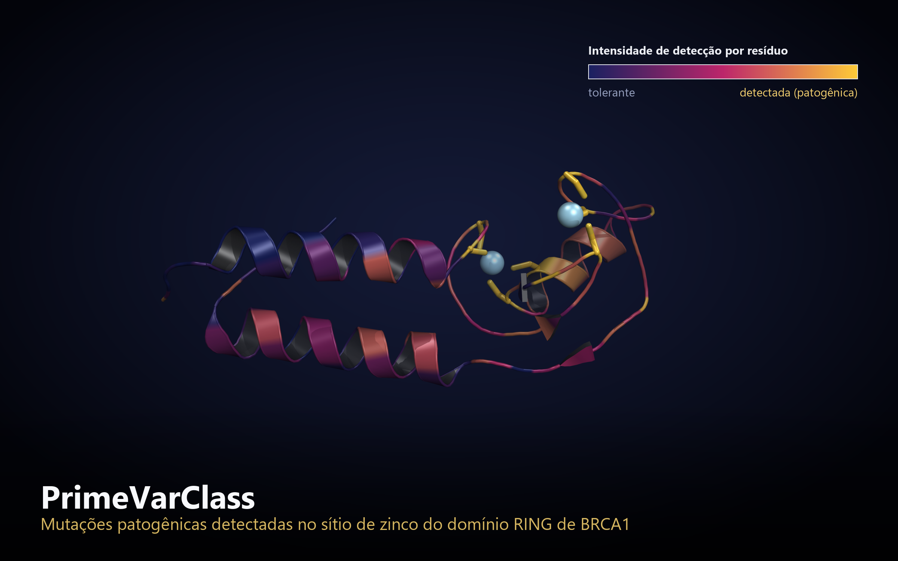

O domínio **RING** de BRCA1 usa dois íons de **zinco** (esferas azul-claras) como
"grampos" que mantêm a proteína dobrada. Cada resíduo está colorido pela
**intensidade com que o PrimeVarClass detecta mutações patogênicas ali**: azul =
tolerante, dourado = patogênica. Note que o dourado se concentra exatamente nas
cisteínas que seguram o zinco — o modelo aprendeu, sem que lhe disséssemos, que
**quebrar o sítio de zinco destrói a proteína**. É aqui que fica a mutação
clássica **C61G**.

### 1.2 Mapa de vulnerabilidade das repetições BRCT (BRCA1)
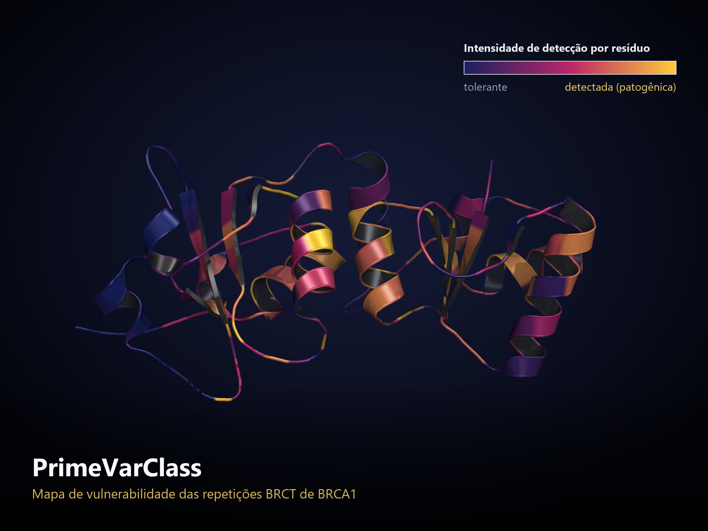

As repetições **BRCT** são a região da BRCA1 que "lê" sinais de dano ao DNA. O
mesmo código de cores mostra onde uma troca de aminoácido é tolerada e onde é
catastrófica. As zonas douradas marcam o núcleo estrutural do domínio — onde vive
a mutação **M1775R**, uma das mais estudadas em câncer de mama hereditário.

### 1.3 As duas variantes patogênicas emblemáticas em 3D
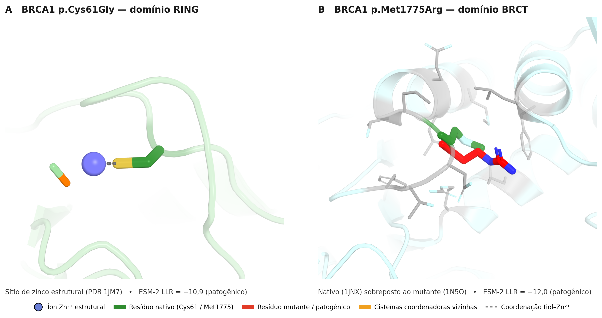

Estruturas reais (PDB) das duas variantes-bandeira que o modelo classifica
corretamente com alta confiança: **C61G** (rompe a coordenação do zinco no RING)
e **M1775R** (desestabiliza o núcleo do BRCT). Servem de "prova de conceito"
visual: o que o modelo aponta como patogênico corresponde a um dano estrutural
concreto e conhecido.

### 1.4 Mutações detectadas ao longo do BRCT
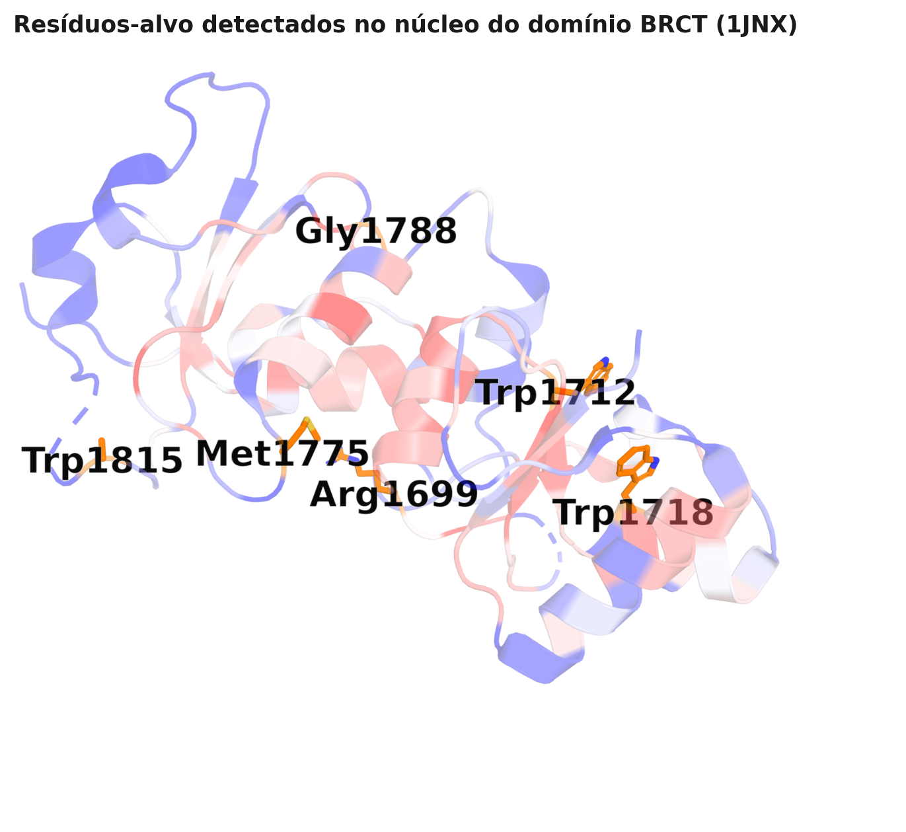

Panorama das posições do BRCT onde o PrimeVarClass sinaliza risco, sobreposto à
estrutura. Ajuda a enxergar que as detecções **não estão espalhadas ao acaso** —
elas se agrupam nas regiões funcionalmente críticas.

---

## 2. Desempenho — à altura dos melhores do mundo

### 2.1 Comparação direta com o estado-da-arte
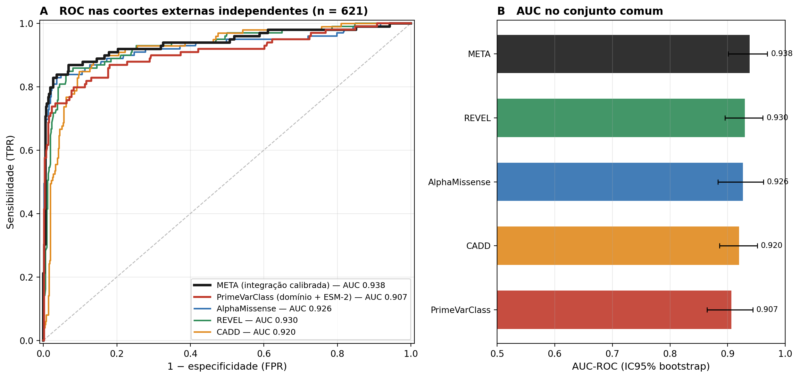

No **mesmo conjunto externo independente** (n = 621 variantes), medimos o
PrimeVarClass lado a lado com os melhores preditores existentes. **AUC** (área sob
a curva ROC) vai de 0,5 (chute) a 1,0 (perfeito):

| Preditor | AUC |
|---|---|
| **META (integração calibrada)** | **0,938** |
| REVEL | 0,930 |
| AlphaMissense | 0,926 |
| CADD | 0,920 |
| **PrimeVarClass (domínio + ESM-2)** | **0,907** |
| SIFT | 0,845 |
| PolyPhen-2 | 0,773 |

Pelo teste estatístico de **DeLong**, o PrimeVarClass é **estatisticamente
equivalente** ao AlphaMissense (p = 0,24), REVEL (p = 0,14) e CADD (p = 0,37) — ou
seja, joga no mesmo nível dos líderes — e é **significativamente superior** aos
clássicos SIFT (p = 0,001) e PolyPhen-2 (p < 10⁻⁶). Na cobertura total do nosso
modelo (n = 836), a AUC é **0,909 (IC95% 0,876–0,939)**.

### 2.2 O meta-classificador supera qualquer ferramenta isolada
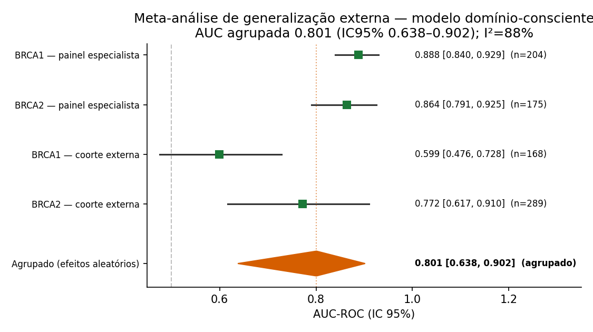

Integrando de forma calibrada PrimeVarClass + AlphaMissense + REVEL + CADD, o
**META** atinge **AUC 0,938 (IC95% 0,901–0,969)** — a melhor marca do estudo. A
mensagem central do projeto: **não competir, mas somar** — o todo rende mais que a
melhor parte.

### 2.3 Curva ROC do modelo nas coortes externas
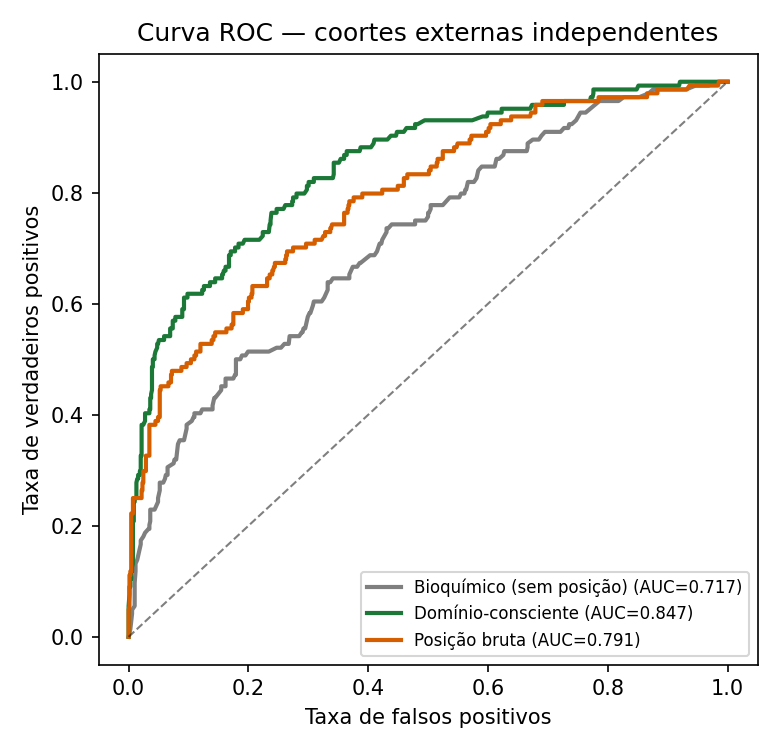

Desempenho do PrimeVarClass em coortes **que ele nunca viu no treino**. A curva
subir rápido para o canto superior esquerdo indica que ele acerta os patogênicos
com poucos falsos alarmes.

### 2.4 Intervalo de confiança por bootstrap

Reamostrando os dados milhares de vezes, estimamos a **incerteza** da AUC. O
intervalo estreito e bem acima de 0,5 mostra que o resultado é **robusto**, e não
sorte de uma partição específica.

### 2.5 Estabilidade em validação cruzada repetida

Repetindo a validação cruzada com várias sementes aleatórias, o desempenho quase
não oscila — sinal de um modelo **estável**, não frágil.

### 2.6 Teste de permutação (prova de ausência de vazamento)

Embaralhando os rótulos de propósito, o desempenho **desaba para o acaso**. Isso
confirma que o sinal aprendido é **real** e que o protocolo anti-vazamento (blocos
por posição + coortes externas) funciona.

---

## 3. Utilidade clínica — onde fazemos a diferença

### 3.1 Complemento ao AlphaMissense na "zona cinzenta"
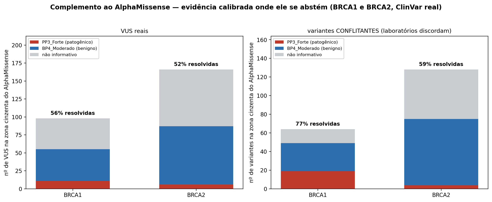

Aqui está o **maior diferencial**. Entre as variantes reais do ClinVar que o
**AlphaMissense classifica como "ambíguas"** (644 no total, BRCA1+BRCA2), o
PrimeVarClass **entrega uma chamada de evidência ACMG calibrada** para boa parte
delas:

- **VUS** (variantes de significado incerto): das 264 na zona cinzenta,
  **resolvemos 53,8%** (17 puxando para patogênico + 125 para benigno).
- **Variantes conflitantes** (laboratórios discordam): das 192, **resolvemos
  64,6%** (23 + 101).
- Nas 17 dessas variantes que já tinham diagnóstico definitivo, nossa
  concordância foi **100% (10/10 chamadas corretas)**, com AUC 0,909.

Ou seja: **fornecemos informação exatamente onde a melhor ferramenta atual se cala.**

### 3.2 Calibração para evidência clínica ACMG/AMP
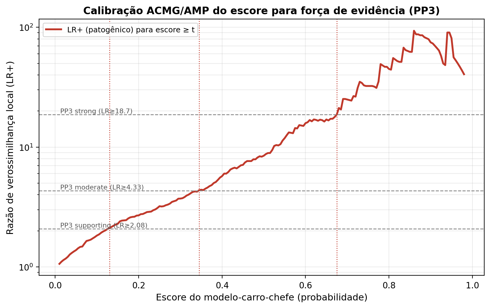

Um score cru não serve ao laboratório clínico; o que ele precisa é de **níveis de
evidência ACMG** (PP3/BP4). Calibramos nossos scores aos limiares de razão de
verossimilhança de Tavtigian/Pejaver. Na validação externa, o nível **"PP3
Forte"** corresponde a **94% de patogênicos reais** (LR ≈ 76; n = 84) e o nível
**"BP4 Moderado"** a apenas **3,2% de patogênicos** (LR ≈ 0,16; n = 444) —
evidência confiável nas duas direções.

### 3.3 Calibração das probabilidades

Quando o modelo diz "70% de chance de ser patogênico", isso se confirma na
prática? A curva de calibração acompanhando a diagonal mostra que **as
probabilidades são honestas** — nem otimistas demais, nem tímidas demais.

### 3.4 Validação temporal (prospectiva, sem olhar o futuro)
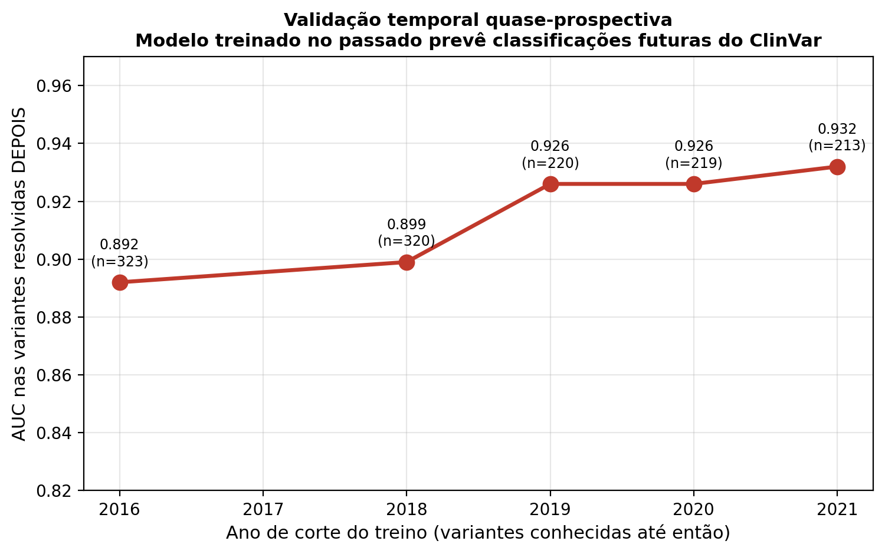

Simulamos o uso **real** da ferramenta: treinamos só com o que se sabia até um ano
X e testamos em variantes classificadas **depois** desse ano. Mesmo assim a AUC se
mantém alta (**0,892 em 2016 → 0,932 em 2021**), provando que o modelo teria
acertado variantes **antes** de a comunidade científica as classificar.

### 3.5 Equidade entre ancestralidades
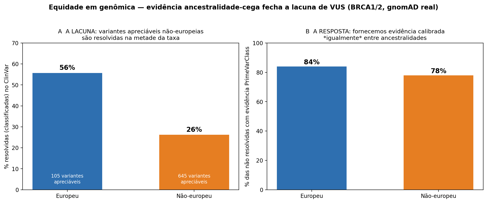

Populações não-europeias são historicamente sub-representadas: entre variantes com
frequência apreciável (AF > 10⁻⁴), apenas **26,2%** têm classificação definitiva,
contra **55,7%** nas europeias. O PrimeVarClass ajuda a fechar essa lacuna —
fornece evidência calibrada para **78%** das variantes não-europeias não resolvidas
(e 84% das europeias), de forma **equitativa**.

---

## 4. Por que funciona — mecanismo e interpretabilidade

### 4.1 O mecanismo previsto bate com a função medida em laboratório

Decompusemos cada variante pelo **mecanismo estrutural** que ela afeta (zinco,
núcleo, interface, superfície) e cruzamos com dados **funcionais reais** de
laboratório (ensaio de reparo de DNA por HDR, 1.262 variantes). As categorias
diferem de forma **altamente significativa** (Kruskal-Wallis p ≈ 3,5 × 10⁻³³): as
que afetam a **coordenação de zinco** são as mais deletérias, as de **superfície**
as mais toleradas — exatamente o esperado pela biologia.

### 4.2 Decomposição por mecanismo estrutural
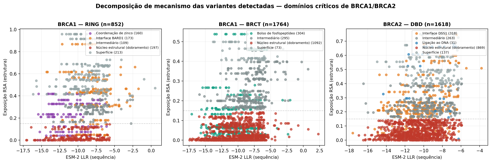

Como calculamos, para cada resíduo, seu **enterramento** (exposição ao solvente) e
sua **distância ao zinco, à interface com BARD1 e ao DNA**, a partir de estruturas
cristalográficas reais (PDB 1JM7, 1T29, 1MJE). Isso torna cada previsão
**interpretável em termos biológicos**, não uma caixa-preta.

### 4.3 Explicabilidade por SHAP
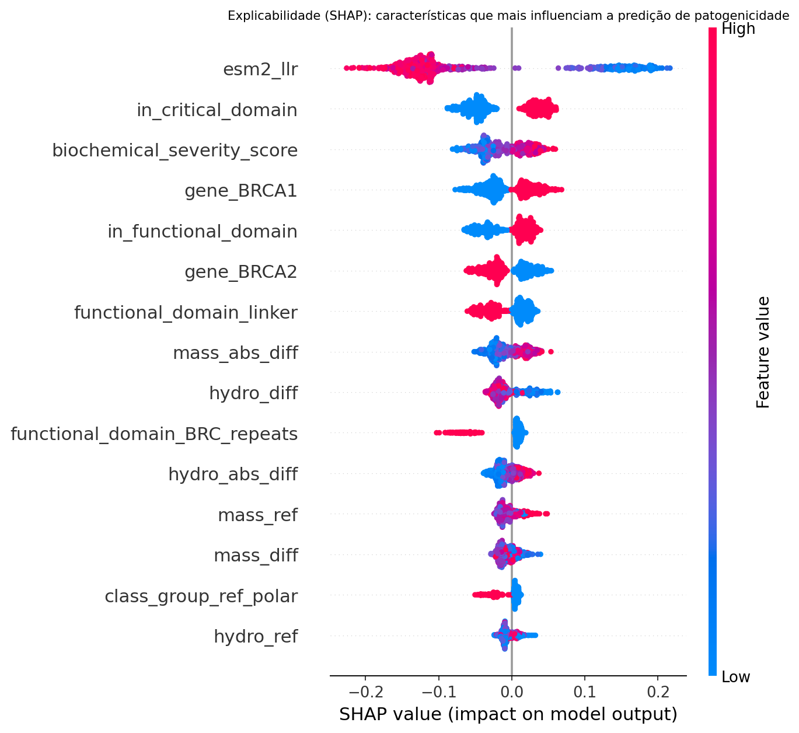

Para cada variante, o **SHAP** mostra *quais fatores* pesaram na decisão (contexto
de domínio, score do ESM-2, enterramento, etc.). Um laboratório pode auditar **por
que** o modelo chamou uma variante de patogênica.

### 4.4 A doença: por que BRCA importa
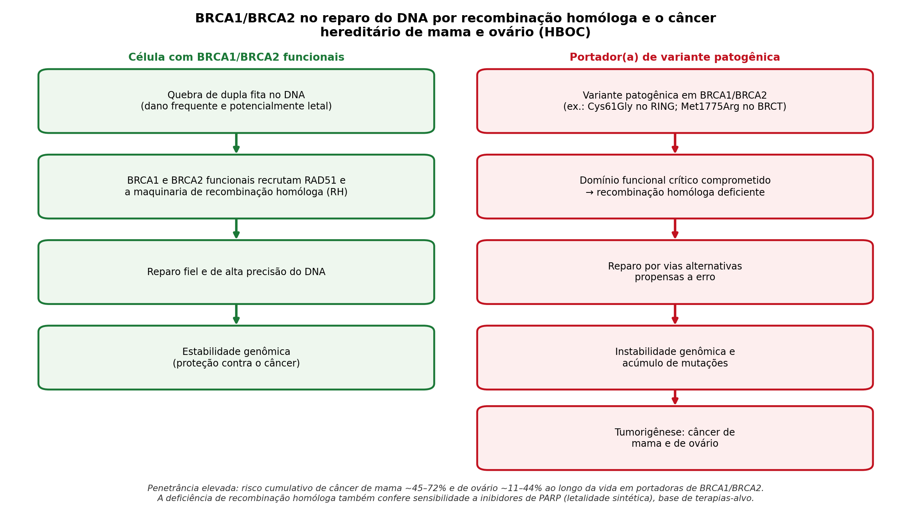

BRCA1/BRCA2 são peças-chave do reparo de DNA por **recombinação homóloga**. Quando
falham, o dano ao DNA se acumula e o risco de câncer de mama e ovário dispara. Por
isso classificar corretamente uma variante tem **impacto direto na vida** de quem
faz o teste genético.

### 4.5 Arquitetura de domínios de BRCA1/BRCA2
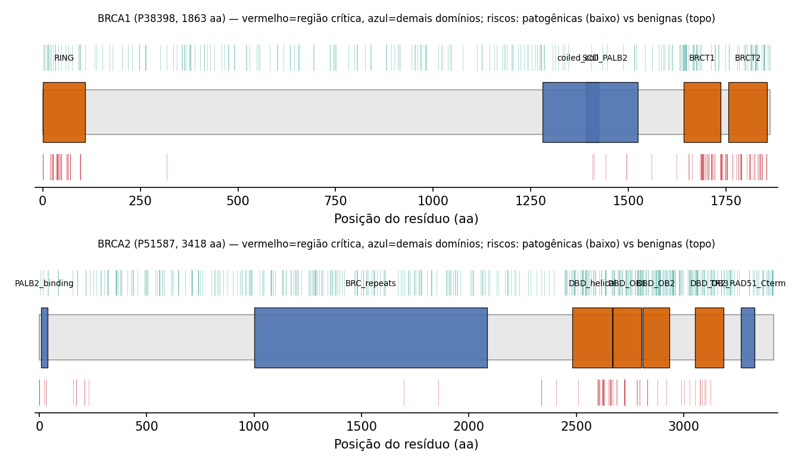

Onde ficam os domínios funcionais (RING, BRCT, DBD…) ao longo da sequência. É o
"mapa" que dá ao modelo o **contexto de domínio** — o ingrediente que o diferencia
de um preditor puramente baseado em sequência.

### 4.6 Patogenicidade por domínio

A fração de variantes patogênicas **não é uniforme** ao longo da proteína: ela se
concentra nos domínios funcionais. Essa é a intuição central — e mensurável — por
trás da abordagem "consciente de domínio".

---

## Reprodutibilidade

Cada figura é gerada por um script versionado em [`scratch/`](../../scratch), a
partir de dados públicos baixados por scripts `fetch_*.py`. Os números citados
vêm dos arquivos `.json`/`.csv` em
[`primevarclass_manuscript_analysis/`](../../primevarclass_manuscript_analysis).
Detalhes completos de métodos estão no
[Material Suplementar](../suplementar/PrimeVarClass_Material_Suplementar.md).

*PrimeVarClass — Wesley Felipe Capucho (EEL-USP). Dados: ClinVar, gnomAD,
AlphaFold DB, MaveDB, Ensembl VEP. Todo o conteúdo é real e auditável.*
