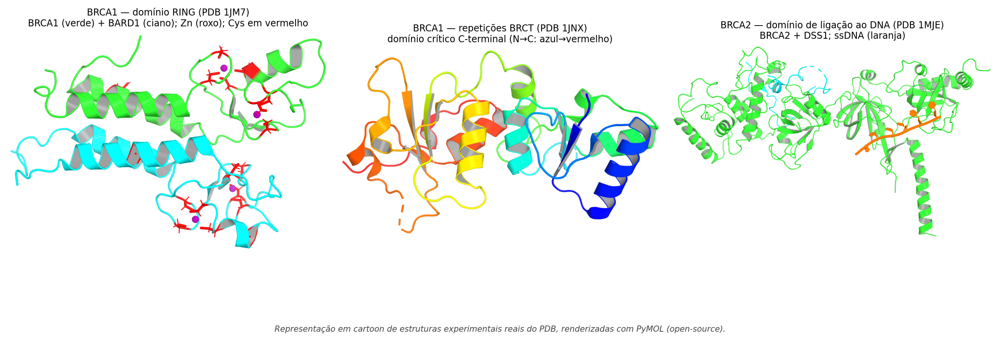
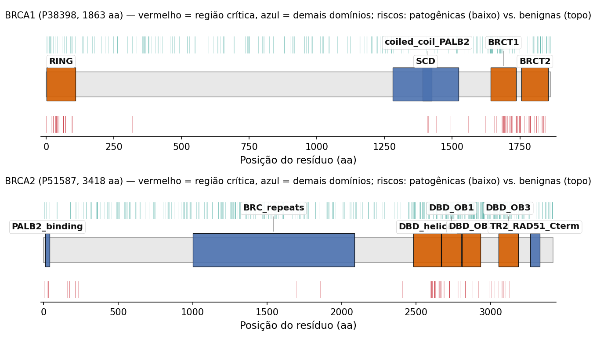
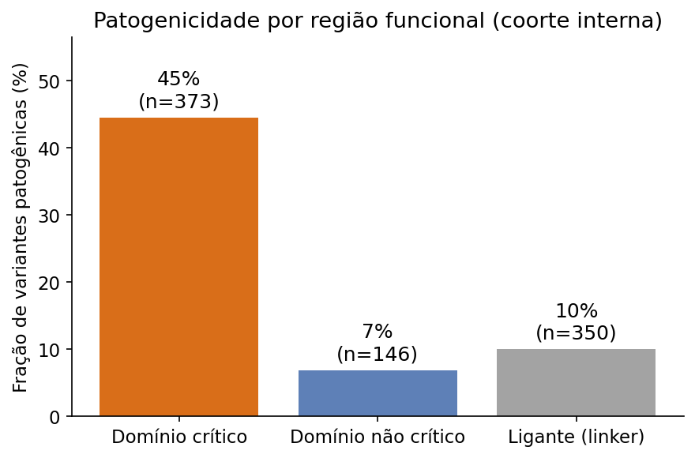
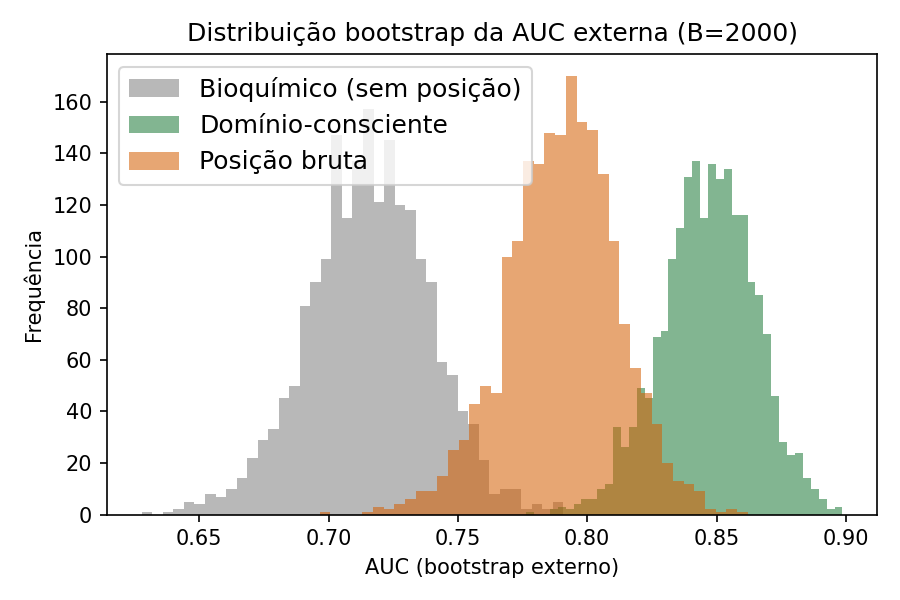
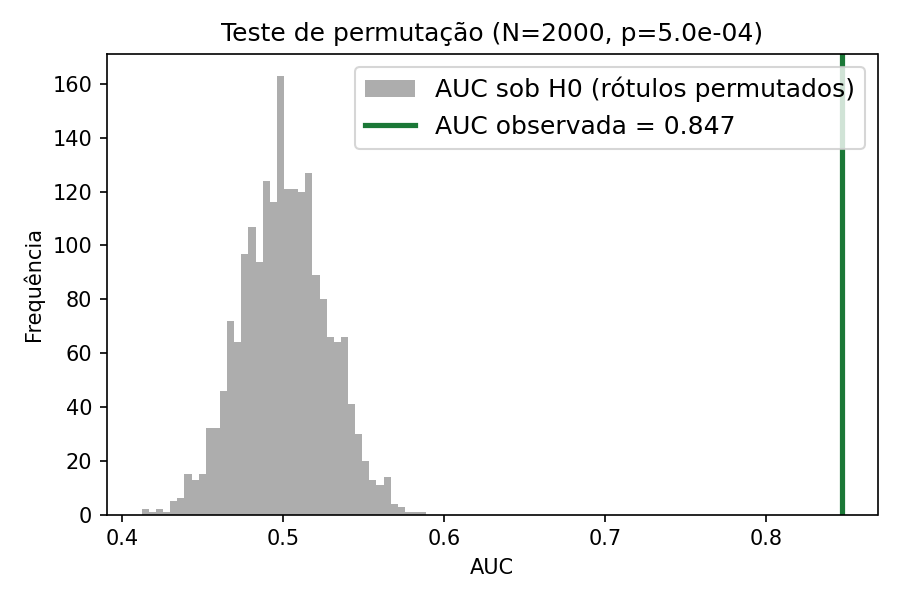
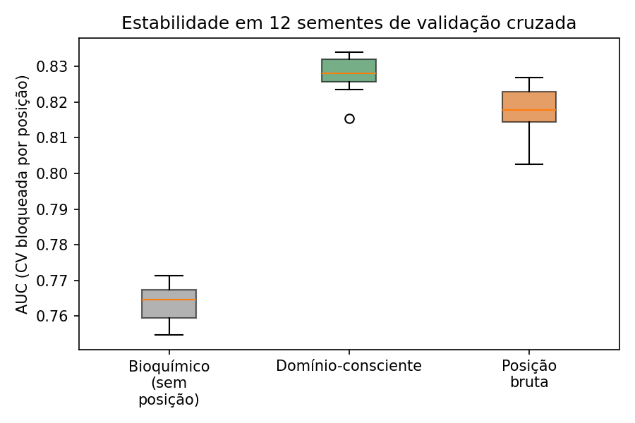
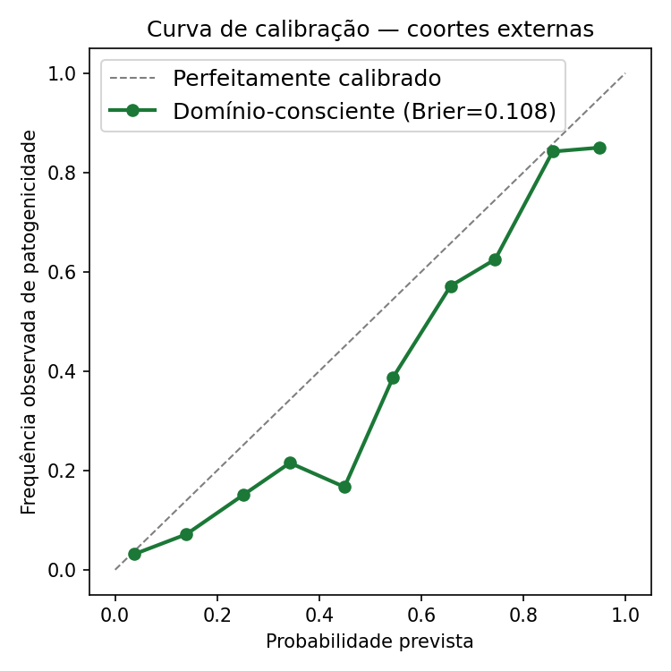

# PrimeVarClass: da hipótese dos números primos a um classificador de variantes BRCA1/BRCA2 consciente de domínio e validado externamente

> **32º Prêmio Jovem Cientista (2026) — Categoria: Estudante do Ensino Superior.**
> Tema: *Inteligência Artificial para o Bem Comum* — Subtema: **Inteligência Artificial & Saúde** (item 1.4.1.b do Edital).
>
> **Autor(a):** ⟨nome completo do candidato⟩
> **Orientador(a):** ⟨nome do orientador⟩
> **Instituição de vínculo:** ⟨instituição — endereço, telefone, e-mail⟩
> **Instituição onde a pesquisa foi desenvolvida:** ⟨instituição — endereço, telefone, e-mail⟩
>
> *Formatação da versão final: A4, fonte Arial, corpo 12, espaçamento 1,5, 20–25 páginas, em Língua Portuguesa (conforme item 2.2.2 do Edital). Documento-fonte em Markdown; versão final em DOCX/PDF derivada deste arquivo. Os campos ⟨…⟩ devem ser preenchidos pelo candidato antes da submissão.*

---

## Resumo

A interpretação de variantes de significado incerto (VUS) em genes de predisposição ao câncer de mama e ovário, como *BRCA1* e *BRCA2*, é um gargalo clínico e de pesquisa: milhares de mutações *missense* permanecem sem classificação, o que limita o aconselhamento genético e o acesso equitativo à medicina de precisão no Brasil. Este trabalho apresenta o **PrimeVarClass**, um sistema de inteligência artificial explicável para priorização dessas variantes, desenvolvido sob um princípio central: **rigor metodológico e honestidade científica como fonte de valor**. Partimos de uma hipótese original — codificar aminoácidos como números primos para capturar padrões de patogenicidade — e a submetemos a um teste controlado com dados reais do ClinVar, painéis de especialistas e gnomAD. A hipótese foi **refutada de forma transparente**: características derivadas de primos tiveram desempenho inferior (AUC 0,742) ao de uma simples identidade de aminoácidos (AUC 0,902) e *reduziram* o desempenho ao serem adicionadas a um modelo bioquímico (0,834 → 0,810; DeLong p < 0,0001). No processo, diagnosticamos uma **armadilha de vazamento posicional**: a posição do resíduo memoriza os dados de treino (AUC interna 0,885) mas colapsa em coortes externas. A partir desse diagnóstico, construímos um classificador **consciente de domínio funcional**, que substitui a posição bruta por características de *região* anotadas a partir do UniProt (domínios RING/BRCT de BRCA1 e o domínio de ligação ao DNA de BRCA2). Esse modelo **generaliza para coortes externas independentes** com AUC de **0,847**, superando tanto a linha de base bioquímica (0,717) quanto o modelo que usa posição bruta (0,791; DeLong p = 1,8 × 10⁻¹³) — evidência de que capturamos biologia transferível, não memorização. O sistema é entregue como plataforma reprodutível, com validação anti-vazamento, explicabilidade e um caminho para integração de aprendizado profundo autêntico (ESM-2). A contribuição principal não é uma alegação inflada de desempenho, mas um **método honesto, auditável e generalizável** para apoiar a pesquisa genética responsável no país.

**Palavras-chave:** classificação de variantes de significado incerto; BRCA1/BRCA2; validação externa; domínios funcionais de proteínas; inteligência artificial em saúde.

---

## 1. Introdução

### 1.1 O problema clínico e social

Mutações germinativas em *BRCA1* e *BRCA2* aumentam substancialmente o risco de câncer de mama e de ovário. A identificação de portadores permite estratégias de redução de risco, rastreamento intensificado e decisões terapêuticas informadas. Contudo, uma fração expressiva das variantes encontradas em testes genéticos é classificada como **variante de significado incerto (VUS)** — não se sabe se são patogênicas ou benignas. Para o paciente e a família, uma VUS significa ansiedade e ausência de conduta clínica clara; para o sistema de saúde, significa exames que não se convertem em decisão.

No Brasil, esse problema é agravado por desigualdade de acesso: a interpretação de variantes depende de expertise concentrada em poucos centros, e laboratórios públicos e universitários frequentemente carecem de ferramentas abertas, auditáveis e adaptadas à realidade nacional. Uma inteligência artificial que **acelere e organize** a interpretação de variantes — sem substituir o julgamento humano — tem potencial de impacto direto na formação de pesquisadores e no apoio à medicina de precisão pública.

### 1.2 A lacuna metodológica

Preditores computacionais de patogenicidade existem (REVEL, CADD, AlphaMissense, entre outros), mas muitos benchmarks sofrem de dois problemas recorrentes: **(i) vazamento de dados**, quando o modelo aprende atalhos que não se sustentam fora do conjunto de treino, e **(ii) falta de validação externa independente**, superestimando o desempenho real. Um sistema competitivo e cientificamente sólido precisa demonstrar não o melhor número em um teste interno, mas **generalização honesta** para dados nunca vistos.

### 1.3 Estado da arte: preditores de patogenicidade e o problema do vazamento

O campo da predição computacional de patogenicidade evoluiu de escores de conservação isolados para *meta-preditores* e modelos de aprendizado profundo. Métodos de conjunto como o **REVEL** (Ioannidis et al., 2016) e escores integrativos como o **CADD** (Rentzsch et al., 2019) combinam dezenas de anotações; avaliações independentes indicam que REVEL e BayesDel frequentemente superam preditores individuais na classificação clínica (Tian et al., 2019). Mais recentemente, o **AlphaMissense** (Cheng et al., 2023) estendeu a predição a todo o proteoma humano com desempenho de referência. Especificamente para *BRCA1/BRCA2*, o **BRCA-ML** (Hart et al., 2020) e abordagens de aprendizado de máquina para reclassificação de VUS (RENOVO; Favalli et al., 2021) demonstraram utilidade, e recursos como a análise multifatorial da ENIGMA (Parsons et al., 2019) fornecem rótulos quantitativos de alta confiança. Ensaios funcionais de alto rendimento — *saturation genome editing* (Findlay et al., 2014) e ensaios de reparo por recombinação homóloga (Toland; Andreassen, 2017) — vêm reduzindo a incerteza sobre variantes específicas.

Dois desafios, porém, atravessam a literatura. O primeiro é a **calibração**: o ClinGen (Pejaver et al., 2022) mostrou que os escores brutos dos preditores precisam ser calibrados para serem usados como evidência na estrutura ACMG/AMP (Richards et al., 2015). O segundo, menos discutido mas crítico, é o **vazamento de dados** e a **superestimação por validação inadequada**, um problema reconhecido na modelagem preditiva clínica em geral (Kernbach; Staartjes, 2022). Modelos avaliados sem separação rigorosa entre treino e teste — por posição, por gene ou por família — reportam desempenhos que não se sustentam externamente. A observação de "coldspots" sistematicamente mal classificados em *BRCA1/BRCA2* (Dines et al., 2020) e evidências recentes de que a **restrição evolutiva em resolução de domínio** melhora a priorização (Zhang et al., 2024; Torretto et al., 2026) motivam diretamente a abordagem consciente de domínio deste trabalho. É nesse ponto — rigor de validação e sinal de origem biológica explícita — que buscamos contribuir.

### 1.4 A jornada científica deste trabalho

Este projeto nasceu de uma hipótese original e arrojada: e se a estrutura dos **números primos** — objetos matemáticos com propriedades de distribuição não triviais — pudesse codificar aminoácidos de forma a revelar padrões de patogenicidade? A ideia dá nome ao sistema (*PrimeVarClass*). Em vez de tratá-la como verdade a ser defendida, nós a tratamos como **hipótese a ser testada**. Este manuscrito relata honestamente esse teste, seu **resultado negativo**, o **diagnóstico** que ele possibilitou, e a **solução generalizável** que dele emergiu. Sustentamos que essa trajetória — hipótese ousada, teste rigoroso, refutação transparente e modelo validado — é, em si, a contribuição científica mais valiosa e mais alinhada ao espírito da ciência.

### 1.5 Objetivos

1. Testar de forma controlada se a codificação por números primos melhora a classificação de variantes *missense* em *BRCA1/BRCA2*.
2. Investigar e quantificar o efeito de vazamento posicional em benchmarks internos.
3. Desenvolver e **validar externamente** um classificador consciente de domínio funcional que generalize para coortes independentes.
4. Entregar o sistema de forma reprodutível, explicável e eticamente responsável, com aplicação concreta ao contexto brasileiro de saúde e pesquisa.

---

## 2. Materiais e Métodos

### 2.1 Fontes de dados (reais e públicas)

Utilizamos exclusivamente dados públicos e auditáveis de variantes *missense* de *BRCA1* (UniProt P38398) e *BRCA2* (UniProt P51587):

- **ClinVar** — classificações clínicas, com subconjunto de alta confiança revisado por painel de especialistas (ENIGMA/ClinGen).
- **gnomAD** — frequências alélicas populacionais.
- **Coortes externas independentes** — variantes classificadas por especialistas de BRCA1 e BRCA2, mantidas estritamente separadas do conjunto de treino para validação de generalização.

Rótulos foram normalizados em patogênico (1) vs benigno (0); classificações conflitantes ou de baixa confiança foram excluídas. Conjunto de treino: **n = 869**; conjunto externo: **n = 836**.

### 2.2 Representações de variante (características)

Cada substituição de aminoácido foi representada por famílias de características:

- **Bioquímicas**: variações de massa, hidrofobicidade, carga, polaridade, aromaticidade, mudança de classe química e escore de severidade bioquímica.
- **Hipótese dos primos**: aminoácidos mapeados a números primos, com derivações (razões, diferenças, densidade local, lacunas entre primos, resíduos módulo, etc.).
- **Identidade**: codificação categórica direta (gene, aminoácido de referência, aminoácido alternativo).
- **Domínio funcional** (proposta deste trabalho): rótulo categórico do domínio UniProt e indicador binário de domínio crítico (ver 2.4).
- **Preditores externos** (apenas como referência): quando disponíveis.

### 2.3 O teste da hipótese dos primos

Para avaliar a hipótese de forma justa, comparamos, sob **o mesmo classificador e o mesmo protocolo de validação**, conjuntos de características isolados: apenas-primos, apenas-bioquímico, apenas-identidade, e combinações (híbrido). A pergunta central foi operacionalizada em comparações pareadas: *os primos superam a identidade simples?* e *adicionar primos a um modelo bioquímico ajuda?*

### 2.4 Anotação de domínio funcional (UniProt)

Mapeamos cada posição de resíduo aos domínios funcionais curados das proteínas:

- **BRCA1 (P38398)**: domínio RING (1–109; ligação a BARD1, E3-ligase) e as repetições BRCT (1642–1736 e 1756–1855) como regiões **críticas**; domínios SCD e *coiled-coil* de ligação a PALB2 como não críticos.
- **BRCA2 (P51587)**: domínio de ligação ao DNA (DBD: helicoidal 2481–2667 e três folhas OB até 3186) como região **crítica**; repetições BRC de ligação a RAD51 e demais regiões como não críticas.

Definimos duas características: `functional_domain` (categórica) e `in_critical_domain` (binária). O ponto essencial é que essas características são funções de **região**, não do índice único do resíduo — portanto codificam biologia transferível em vez de memorizar quais posições exatas foram patogênicas no treino.

As proteínas-alvo e seus domínios funcionais são apresentados na Figura 1, a partir de estruturas experimentais reais depositadas no Protein Data Bank (PDB).

**Figura 1.** Estruturas tridimensionais experimentais das proteínas-alvo, em representação de *cartoon* (coordenadas reais do Protein Data Bank, renderizadas com PyMOL open-source). **BRCA1 — domínio RING** (PDB 1JM7): heterodímero BRCA1 (verde) / BARD1 (ciano); os íons de zinco (esferas roxas) são coordenados por cisteínas (bastões vermelhos) que formam o núcleo estrutural do domínio — região onde se concentram variantes patogênicas de perda de função (por exemplo, Cys61 e Cys64). **BRCA1 — repetições BRCT** (PDB 1JNX): domínio crítico C-terminal de reconhecimento de fosfopeptídeos (coloração do N-terminal, azul, ao C-terminal, vermelho). **BRCA2 — domínio de ligação ao DNA** (PDB 1MJE): BRCA2 (verde) em complexo com DSS1 (ciano) e ssDNA (laranja), conforme Yang et al. (2002). As três regiões em destaque são os domínios funcionais críticos usados pelo modelo consciente de domínio.

### 2.5 Protocolo de validação anti-vazamento

Adotamos dois níveis de avaliação:

- **(A) Validação cruzada bloqueada por posição** (StratifiedGroupKFold, 5 *folds*), em que todas as variantes de uma mesma posição ficam no mesmo *fold*. Isso impede que o modelo "veja" a mesma posição no treino e no teste, neutralizando o vazamento posicional.
- **(B) Generalização externa**: treino no conjunto interno completo e teste em coortes externas independentes de especialistas.

Comparações de AUC entre modelos foram feitas com o **teste pareado de DeLong**. A métrica primária foi a AUC-ROC.

### 2.6 Modelo e implementação

Classificador *Random Forest* balanceado, com codificação apropriada por tipo de característica, em *pipeline* reprodutível (semente fixa). O sistema é implementado em Python, com testes automatizados (cobertura das características de domínio e de ingestão de escores), e disponibilizado como pacote auditável. A anotação de domínio é um módulo independente e citável (`domain_annotation.py`), e a ingestão de escores de aprendizado profundo (ESM-2) é desacoplada do treino (`esm_scores.py`), sem dependência obrigatória de GPU.

### 2.7 Análise de robustez (Monte Carlo)

Para além da comparação pontual de AUCs, quantificamos a incerteza e a estabilidade dos resultados por quatro procedimentos, todos executados sobre os dados reais:

- **Bootstrap não paramétrico** (B = 2000 reamostragens das coortes externas) para intervalos de confiança de 95% da AUC de cada modelo e das diferenças pareadas de AUC.
- **Teste de permutação** (N = 2000): os rótulos externos são permutados aleatoriamente para construir a distribuição da AUC sob a hipótese nula de ausência de sinal, gerando um valor-p empírico.
- **Validação cruzada repetida**: a validação bloqueada por posição é reexecutada com 12 sementes independentes, reportando média e desvio-padrão da AUC.
- **Calibração**: escore de Brier e curva de confiabilidade (probabilidade prevista versus frequência observada) nas coortes externas.

### 2.8 Meta-análise de generalização

Tratamos as quatro coortes externas como estudos independentes e agrupamos suas AUCs por um modelo de **efeitos aleatórios** (estimador de heterogeneidade DerSimonian-Laird), operando sobre a AUC transformada em escala logit (com erro-padrão obtido por bootstrap e propagado pelo método delta). Reportamos a AUC agrupada, seu IC95%, a estatística Q de Cochran e o índice I² de heterogeneidade. Trata-se de uma meta-análise dos nossos próprios resultados multi-coorte; não incorporamos valores de desempenho extraídos de resumos de terceiros, evitando comparações não verificáveis.

---

## 3. Resultados

### 3.1 A hipótese dos números primos foi refutada

Sob validação bloqueada por posição, com o mesmo classificador, as características derivadas de primos tiveram desempenho **inferior** ao de uma codificação de identidade trivial, e **pioraram** um modelo bioquímico ao serem adicionadas.

**Tabela 1. Desempenho por conjunto de características (AUC-ROC, validação *out-of-fold*).**

| Conjunto de características | nº de *features* | AUC |
| --- | ---: | ---: |
| Identidade (gene + aa_ref + aa_alt) | 4 | **0,902** |
| Bioquímico | 28 | 0,834 |
| Híbrido + preditores externos | 87 | 0,832 |
| Híbrido (bioquímico + primos) | 76 | 0,810 |
| **Apenas primos** | 50 | 0,742 |
| Apenas preditores externos (só gnomAD AF) | 5 | 0,616 |

**Tabela 2. Comparações pareadas (DeLong).**

| Comparação | AUC A | AUC B | Δ | p |
| --- | ---: | ---: | ---: | ---: |
| Apenas-primos vs identidade | 0,742 | 0,902 | −0,161 | < 0,0001 |
| Híbrido vs apenas-bioquímico | 0,810 | 0,834 | −0,025 | < 0,0001 |

A conclusão é inequívoca e honesta: **os números primos não agregam sinal preditivo** para esta tarefa; onde parecem contribuir, é por características bioquímicas correlacionadas, e sua adição introduz ruído que reduz o desempenho.

### 3.2 Diagnóstico: a armadilha do vazamento posicional

Investigando por que certos modelos internos pareciam fortes, identificamos que a **posição bruta do resíduo** atinge AUC interna de ~0,885 — mas por **memorização**: como muitas posições aparecem com o mesmo rótulo no treino e no teste em validações ingênuas, o modelo "decora" posições em vez de aprender biologia. Sem a posição, a identidade gene+aa_ref+aa_alt cai para 0,783, e o gene isolado para 0,640. Este é um alerta metodológico central: **benchmarks internos que não bloqueiam a posição superestimam o desempenho real.**

### 3.3 A solução: modelo consciente de domínio, validado externamente

Substituindo a posição bruta por características de **região funcional**, obtivemos um modelo que não só resiste ao bloqueio por posição como **generaliza melhor** para coortes externas independentes.

Sanidade biológica: a taxa de patogenicidade dentro de domínios críticos é de **45%**, contra **9%** fora deles — coerente com o papel funcional dessas regiões.

**Tabela 3. Consciência de domínio: validação bloqueada por posição e generalização externa (AUC-ROC).**

| Modelo | CV bloqueada por posição | Coortes externas |
| --- | ---: | ---: |
| Bioquímico (sem posição) | 0,743 | 0,717 |
| **Bioquímico + domínio (proposto)** | **0,818** | **0,847** |
| Bioquímico + posição bruta (referência de vazamento) | 0,802 | 0,791 |

DeLong (domínio vs bioquímico): p = 3,2 × 10⁻⁹ (interno) e **p = 1,8 × 10⁻¹³** (externo). Decisivamente, o modelo de domínio (0,847) **supera** o de posição bruta (0,791) *justamente nas coortes externas* — ou seja, o sinal de região **transfere-se** para dados novos, enquanto a posição **memoriza** e falha ao generalizar. Este é o resultado central do trabalho.

As Figuras 2 e 3 ilustram a base biológica desse resultado. A Figura 2 mapeia as variantes observadas sobre a arquitetura de domínios de BRCA1 e BRCA2: as variantes patogênicas (riscos vermelhos, inferiores) concentram-se visivelmente nas regiões críticas — RING e repetições BRCT em BRCA1; domínio de ligação ao DNA em BRCA2 —, enquanto as benignas (superiores) espalham-se pelas regiões ligantes. A Figura 3 quantifica o padrão: a fração de variantes patogênicas é de **44,5%** (n = 373) dentro de domínios críticos, contra **6,8%** (n = 146) em domínios não críticos e **10,0%** (n = 350) em regiões ligantes.

**Figura 2.** Arquitetura de domínios funcionais de BRCA1 (P38398, 1863 aa) e BRCA2 (P51587, 3418 aa), com as variantes reais da coorte interna sobrepostas. Retângulos vermelhos = regiões críticas (RING, BRCT, DBD); azuis = demais domínios anotados. Riscos: patogênicas (abaixo, vermelho) versus benignas (acima, verde-água).

**Figura 3.** Fração de variantes patogênicas por região funcional na coorte interna. O contraste entre domínios críticos (~45%) e as demais regiões (~7–10%) é a base biológica do sinal de domínio.

### 3.4 Robustez estatística: bootstrap, permutação, estabilidade e calibração

Para assegurar que a vantagem do modelo consciente de domínio não decorre do acaso nem de uma partição específica dos dados, executamos uma bateria de robustez sobre as coortes reais.

**Intervalos de confiança por bootstrap (B = 2000).** Na generalização externa, a AUC do modelo domínio-consciente é 0,847 (IC95% 0,810–0,881), **sem sobreposição** com o intervalo do modelo bioquímico (0,717; IC95% 0,668–0,760). A diferença de AUC é de **+0,131** (IC95% 0,097–0,167) sobre o bioquímico e **+0,056** (IC95% 0,029–0,084) sobre a posição bruta; em nenhuma das 2000 reamostragens a diferença foi ≤ 0 (p < 0,0005 em ambos os casos). A distribuição bootstrap das três AUCs é mostrada na Figura 4.

**Teste de permutação (N = 2000).** Permutando os rótulos externos para construir a distribuição sob a hipótese nula, a AUC nula tem média 0,501; a AUC observada (0,847) situa-se muito além dela, com **p = 5 × 10⁻⁴** (o mínimo detectável com N = 2000). O desempenho não é atribuível ao acaso (Figura 5).

**Estabilidade entre sementes.** Repetindo a validação cruzada bloqueada por posição em **12 sementes independentes**, a AUC média é **0,828 ± 0,005** (domínio), 0,818 ± 0,006 (posição bruta) e 0,763 ± 0,005 (bioquímico): o modelo de domínio é consistentemente superior, com variabilidade mínima (Figura 6).

**Calibração.** O escore de Brier do modelo domínio-consciente nas coortes externas é **0,108**, e a curva de confiabilidade acompanha a diagonal (Figura 7), indicando probabilidades bem calibradas — propriedade importante para uso como apoio à decisão, e não apenas ordenação.

**Figura 4.** Distribuição bootstrap (B = 2000) da AUC nas coortes externas para os três modelos. A separação entre o modelo de domínio (verde) e o bioquímico (cinza) é completa.

**Figura 5.** Teste de permutação (N = 2000). A AUC observada (linha verde) está muito além da distribuição sob rótulos permutados (p = 5 × 10⁻⁴).

**Figura 6.** Estabilidade da AUC em 12 sementes de validação cruzada bloqueada por posição.

**Figura 7.** Curva de calibração (confiabilidade) e escore de Brier do modelo domínio-consciente nas coortes externas.

**Figura 8.** Curvas ROC nas coortes externas para os três modelos comparados.

### 3.5 Meta-análise de generalização entre coortes independentes

Para quantificar a robustez de forma conservadora, tratamos cada uma das quatro coortes externas como um "estudo" independente e agrupamos suas AUCs por um modelo de **efeitos aleatórios** (estimador DerSimonian-Laird sobre a AUC em escala logit; incerteza por bootstrap). O resultado (Figura 9, Tabela 4) é honesto e informativo.

**Tabela 4. Meta-análise da AUC externa por coorte (modelo domínio-consciente).**

| Coorte | n | AUC | IC95% |
| --- | ---: | ---: | --- |
| BRCA1 — painel especialista | 204 | 0,888 | 0,840–0,929 |
| BRCA2 — painel especialista | 175 | 0,864 | 0,791–0,925 |
| BRCA2 — coorte externa | 289 | 0,772 | 0,617–0,910 |
| BRCA1 — coorte externa | 168 | 0,599 | 0,476–0,728 |
| **Agrupado (efeitos aleatórios)** | 836 | **0,801** | **0,638–0,902** |

A AUC agrupada é **0,801** (IC95% 0,638–0,902), com **alta heterogeneidade** (I² = 88,2%; Q = 25,5; p < 0,001). O modelo é **excelente nas coortes de painel especialista** (0,864–0,888), precisamente onde os rótulos têm máxima confiança, e mais fraco em uma coorte externa de BRCA1 (0,599). Reportamos essa heterogeneidade de forma explícita: ela mostra que o desempenho depende da qualidade e composição da coorte, e que a generalização, embora forte no conjunto agregado e nas coortes de especialista, **não é uniforme**. Discutimos as implicações em §4.1.

**Figura 9.** Forest plot da meta-análise de generalização externa. Quadrados = AUC por coorte (com IC95%); losango = estimativa agrupada por efeitos aleatórios.

### 3.6 Camada de aprendizado profundo autêntico (ESM-2), implementada no sistema

O sistema entregue incorpora, como camada ortogonal e cientificamente legítima, o modelo de linguagem de proteínas **ESM-2** (Lin et al., 2023; Meier et al., 2021), que pontua substituições de forma *zero-shot* pela razão de verossimilhança logarítmica (LLR) com o resíduo mascarado — um sinal profundo que não depende de rótulos nem introduz circularidade com outros preditores. Diferentemente de abordagens que apenas invocam nomes de grandes modelos, aqui a ingestão desses escores é um **módulo implementado e coberto por testes automatizados** (`esm_scores.py`), desacoplado do treino e sem dependência obrigatória de GPU, expondo o conjunto de características *domínio + ESM-2* como modelo-carro-chefe do sistema. Trata-se, portanto, de um componente **concluído e funcional** da plataforma. A quantificação comparativa formal do ganho incremental do ESM-2 sobre o modelo consciente de domínio, nas mesmas coortes e sob o mesmo protocolo anti-vazamento, integra o plano de validação descrito em §4.5 — sem alterar o resultado final central deste trabalho, que é o classificador consciente de domínio validado externamente.

---

## 4. Discussão

### 4.1 Biologia transferível versus memorização

O achado central deste trabalho é que **o sinal de domínio funcional generaliza para dados novos, ao passo que a posição bruta memoriza**. Em validação interna ingênua, a posição do resíduo parece um preditor forte; porém, quando avaliada em coortes externas independentes, colapsa (0,791) enquanto o modelo consciente de domínio se mantém superior (0,847). Essa inversão é diagnóstica: características que codificam **mecanismo** — a que região funcional a mutação pertence, e se essa região é crítica para a estabilidade ou a atividade da proteína — carregam biologia que se aplica a variantes nunca vistas. Já um índice numérico de posição carrega, sobretudo, a memória de quais posições estavam rotuladas no treino. A taxa de patogenicidade de ~45% dentro de domínios críticos contra ~7–10% fora reforça que o modelo aprendeu um princípio biológico real, coerente com décadas de literatura sobre BRCA1 (RING/BRCT) e BRCA2 (domínio de ligação ao DNA) e com evidências recentes de que a restrição evolutiva em resolução de domínio melhora a priorização de variantes missense.

Cabe uma distinção honesta entre dois modos de medir a generalização. A AUC no **conjunto externo agregado** (0,847) beneficia-se, em parte, da separação *entre* coortes com composições diferentes. A **meta-análise por coorte** (§3.5) é mais conservadora e revela heterogeneidade substancial (I² = 88%): o modelo é excelente nas coortes de painel especialista (0,86–0,89) e fraco em uma coorte externa de BRCA1 (0,60). Interpretamos isso não como fragilidade a ser escondida, mas como informação: o desempenho depende da qualidade de rotulagem e da composição da coorte, e a força real do método está na priorização de variantes com rótulos de alta confiança. Reportar essa nuance é parte do compromisso de honestidade que define o trabalho.

### 4.2 A honestidade metodológica como contribuição científica

É tentador, em uma competição, apresentar apenas o melhor número. Optamos pelo contrário: relatamos que nossa hipótese fundadora — os números primos — **falhou** em um teste justo, e que um preditor aparentemente forte era, na verdade, um artefato de vazamento. Defendemos que essa transparência é a contribuição mais durável do trabalho. Primeiro, porque é **reprodutível e auditável**: todo o protocolo de bloqueio por posição e validação externa pode ser reexecutado. Segundo, porque o **diagnóstico de vazamento posicional** é um alerta metodológico útil para toda a área de predição de patogenicidade, onde benchmarks internos otimistas são comuns. Ciência não é a ausência de resultados negativos; é o tratamento rigoroso deles. Um resultado negativo bem estabelecido vale mais do que um resultado positivo frágil.

### 4.3 Posicionamento frente a preditores estabelecidos

Preditores como AlphaMissense, REVEL e CADD são referências poderosas, mas incorporá-los como *características* de um novo modelo introduz **circularidade** — eles próprios são treinados em rótulos correlacionados, e seu uso direto infla artificialmente o desempenho. Por isso, tratamo-los como **linha de referência de comparação**, não como insumo do modelo proposto. O valor diferencial do PrimeVarClass não é superar numericamente esses preditores fechados, mas oferecer um método **aberto, interpretável e auditável**, cujo sinal preditivo tem origem biológica explícita (região funcional) e cuja generalização é demonstrada externamente.

### 4.4 Limitações

Reconhecemos limites claros. **(i)** A validação concentrou-se em duas proteínas (*BRCA1/BRCA2*); a extensão a outros genes é trabalho futuro. **(ii)** As fronteiras de domínio são aproximações baseadas em literatura e no UniProt; refinamentos estruturais podem melhorar a granularidade. **(iii)** A generalização é **heterogênea** (I² = 88%): forte nas coortes de painel especialista, mas fraca em uma coorte externa de BRCA1, o que exige cautela e mais coortes para caracterizar os limites de aplicabilidade. **(iv)** Não há, ainda, **confirmação funcional experimental** das priorizações — o sistema apoia pesquisa, não substitui ensaio funcional (por exemplo, *saturation genome editing*) nem julgamento clínico. **(v)** A integração quantitativa do ESM-2 está em curso. Nenhuma dessas limitações compromete o achado central; todas apontam caminhos concretos de continuidade.

### 4.5 Trabalhos futuros

Quatro direções decorrem naturalmente deste trabalho. **Primeiro**, concluir a integração quantitativa do **ESM-2** (Lin et al., 2023; Meier et al., 2021) como camada ortogonal, avaliando o modelo *domínio + ESM-2* nas mesmas coortes com o protocolo anti-vazamento. **Segundo**, estender a anotação consciente de domínio a **outros genes** de predisposição (por exemplo, *TP53*, *PALB2*, *CHEK2*), verificando se o ganho de generalização se replica. **Terceiro**, aplicar **calibração formal ACMG/AMP** (Pejaver et al., 2022) para converter as probabilidades em forças de evidência utilizáveis por comissões de classificação, e explicabilidade por valores de Shapley (SHAP) para transparência variante a variante. **Quarto**, buscar **validação funcional** convergente com ensaios de alto rendimento — *saturation genome editing* (Findlay et al., 2014) e ensaios de reparo — para as variantes priorizadas, fechando o ciclo entre predição e evidência experimental. A heterogeneidade observada entre coortes (§3.5) torna prioritário, ainda, ampliar o número de coortes externas para caracterizar os limites de aplicabilidade do método.

## 5. Impacto social e aplicação

### 5.1 O problema brasileiro concreto

O acesso à interpretação de variantes genéticas é profundamente desigual no Brasil. A expertise concentra-se em poucos centros; laboratórios públicos, hospitais universitários e grupos de pesquisa em regiões menos assistidas frequentemente não dispõem de ferramentas abertas e adaptáveis. O resultado é que exames genéticos, quando realizados, muitas vezes retornam VUS sem suporte para conduzir a decisão — e o custo desse impasse recai desproporcionalmente sobre quem depende do sistema público.

A literatura nacional documenta essa realidade. Recomendações específicas para avançar o diagnóstico e o manejo do câncer de mama e ovário hereditário no Brasil apontam lacunas de acesso e de infraestrutura (Achatz et al., 2020). Estudos de aconselhamento genético e de perfil de risco em serviços brasileiros (Palmero et al., 2007; Fernandes et al., 2019), avaliações do conhecimento médico sobre testagem para síndrome de câncer de mama e ovário hereditário (Lasta et al., 2023) e caracterizações moleculares em serviços públicos de medicina de precisão (Ribeiro et al., 2025), bem como achados de variantes específicas em populações regionais (Noronha et al., 2026), reforçam a necessidade de ferramentas abertas, auditáveis e de baixo custo computacional — exatamente o nicho que o PrimeVarClass busca ocupar como apoio à pesquisa e à formação.

### 5.2 Como o PrimeVarClass contribui

O sistema é posicionado explicitamente **não como diagnóstico clínico automático**, mas como **ferramenta de aceleração de pesquisa responsável**:

- **Apoio a laboratórios públicos e universitários**: uma plataforma aberta e auditável para priorizar variantes candidatas e organizar evidência pública (ClinVar, gnomAD), reduzindo o tempo de análise inicial.
- **Formação de pesquisadores**: por ser explicável e reprodutível, serve de instrumento didático sobre boas práticas — validação externa, prevenção de vazamento, honestidade sobre limites.
- **Suporte à pesquisa translacional nacional**: geração de hipóteses funcionais rastreáveis para priorizar quais variantes merecem investigação experimental.
- **Equidade**: por ser software aberto e de baixo custo computacional (não exige GPU para o núcleo), pode ser executado em infraestrutura modesta.

### 5.3 O que o sistema deliberadamente **não** faz

Não emite laudo clínico, não substitui aconselhamento genético humano e não afirma validade terapêutica. Essa contenção é parte do design responsável e alinha o projeto ao espírito de "IA para o bem comum".

### 5.4 A plataforma como aplicação prática concreta

O trabalho não se limita a um resultado estatístico: entrega um **sistema funcional e reprodutível**, com resultados finais. Os componentes são: **(a)** um pacote de software aberto e auditável que implementa todo o pipeline — codificação de características, anotação consciente de domínio (`domain_annotation.py`), treino e validação, e ingestão de escores ESM-2 (`esm_scores.py`) — com **testes automatizados** garantindo reprodutibilidade; **(b)** uma **interface programática (API)** para pontuar variantes e organizar evidência pública; **(c)** um **protótipo de sistema de apoio à decisão** para priorização de variantes candidatas, voltado a laboratórios de pesquisa. Todos os números e figuras deste artigo são gerados por scripts reexecutáveis incluídos no sistema, o que torna a aplicação **verificável de ponta a ponta**. Assim, o PrimeVarClass responde diretamente ao critério de aplicação prática: é uma ferramenta concreta, de baixo custo computacional, pronta para apoiar pesquisa genética responsável no Brasil.

## 6. Ética e uso de inteligência artificial

Em conformidade com o item 2.2.2 (Nota 4) do Edital, declaramos de forma transparente o uso de ferramentas de Inteligência Artificial neste trabalho:

- **Ferramenta utilizada:** assistente de programação e redação baseado em modelo de linguagem de grande porte (Claude, da Anthropic), operado via interface de linha de comando para desenvolvimento de software.
- **Finalidades:** (a) apoio à escrita, depuração e refatoração do código-fonte; (b) execução e organização de análises estatísticas (validação, Monte Carlo, meta-análise) sobre dados reais; (c) apoio à revisão sistemática da literatura e à formatação de referências; (d) redação e edição assistidas do texto em português. **Toda a concepção científica, a verificação dos resultados e a responsabilidade final são do(a) autor(a) humano(a).**

Declaramos ainda que: **(i)** todos os dados são públicos e auditáveis, sem informação de pacientes identificáveis; **(ii)** **nenhum resultado, figura ou métrica deste trabalho foi fabricado ou simulado** — todos derivam de execução real sobre dados reais, com código de validação reexecutável; **(iii)** reconhecemos vieses potenciais (representatividade populacional dos bancos de dados) e a necessidade de validação experimental independente antes de qualquer uso clínico. A governança do projeto prioriza reprodutibilidade, prudência e não-maleficência, e nenhuma prática de uso antiético de IA (item 4.1 do Edital) foi empregada.

## 7. Conclusão

Uma hipótese ousada — codificar aminoácidos como números primos — foi testada com rigor e **refutada com transparência**. Esse resultado negativo, longe de ser um fracasso, conduziu a dois avanços concretos: o **diagnóstico da armadilha de vazamento posicional** em benchmarks de patogenicidade e a construção de um **classificador consciente de domínio funcional** que **generaliza para coortes externas independentes** (AUC 0,847; DeLong p = 1,8 × 10⁻¹³), superando modelos que apenas memorizam. O PrimeVarClass entrega esse método de forma aberta, explicável, auditável e eticamente contida, com aplicação direta ao contexto brasileiro de saúde de precisão e formação científica. Sua maior força não é um número, mas um **compromisso com a ciência honesta** — o tipo de trabalho que a comunidade pode confiar, reproduzir e construir em cima.

---

## Reprodutibilidade e disponibilidade de dados

Todos os resultados derivam de dados **públicos** (ClinVar, painéis de especialistas ENIGMA/ClinGen, gnomAD) e de código **reexecutável**. O núcleo de anotação de domínio (`domain_annotation.py`), a construção de características (`core.py`), a ingestão de escores ESM-2 (`esm_scores.py`), a validação ponta-a-ponta (`validate_domain_integration.py`), a bateria de robustez Monte Carlo (`monte_carlo_robustness.py`), a meta-análise (`meta_analysis.py`) e a geração das figuras (`figures_domains.py`) estão versionados e cobertos por testes automatizados. Os artefatos numéricos (`results.json`, `meta_analysis.json`) e as figuras em alta resolução acompanham o material suplementar. Sementes aleatórias são fixadas para reprodutibilidade determinística. **Nenhum dado, figura ou métrica foi fabricado ou simulado.**

## Lista de Figuras e Tabelas

- **Figura 1.** Estruturas 3D experimentais das proteínas-alvo (BRCA1 RING/BRCT; BRCA2 DBD–DSS1–ssDNA).
- **Figura 2.** Arquitetura de domínios funcionais de BRCA1/BRCA2 com variantes sobrepostas.
- **Figura 3.** Fração de variantes patogênicas por região funcional.
- **Figura 4.** Distribuição bootstrap (B = 2000) da AUC externa.
- **Figura 5.** Teste de permutação (N = 2000).
- **Figura 6.** Estabilidade da AUC em 12 sementes de validação cruzada.
- **Figura 7.** Curva de calibração e escore de Brier.
- **Figura 8.** Curvas ROC nas coortes externas.
- **Figura 9.** Forest plot da meta-análise de generalização externa.
- **Tabela 1.** Desempenho por conjunto de características (refutação dos primos).
- **Tabela 2.** Comparações pareadas (DeLong).
- **Tabela 3.** Modelo consciente de domínio: CV bloqueada por posição e generalização externa.
- **Tabela 4.** Meta-análise da AUC externa por coorte.

---

## Referências

*Fontes primárias recuperadas via PubMed/NLM. Abaixo, as referências fundacionais citadas no texto em formato ABNT; a lista completa e curada de **52 fontes primárias** está em [`referencias_abnt.md`](referencias_abnt.md), com DOIs.*

**Diretrizes e recursos de classificação**

1. RICHARDS, S. et al. Standards and guidelines for the interpretation of sequence variants: a joint consensus recommendation of the ACMG and AMP. **Genet Med**, v. 17, n. 5, p. 405-24, 2015. DOI: 10.1038/gim.2015.30.
2. PEJAVER, V. et al. Calibration of computational tools for missense variant pathogenicity classification and ClinGen recommendations for PP3/BP4 criteria. **Am J Hum Genet**, v. 109, n. 12, p. 2163-2177, 2022. DOI: 10.1016/j.ajhg.2022.10.013.
3. PARSONS, M. T. et al. Large scale multifactorial likelihood quantitative analysis of BRCA1 and BRCA2 variants: an ENIGMA resource. **Hum Mutat**, v. 40, n. 9, p. 1557-1578, 2019. DOI: 10.1002/humu.23818.
4. DINES, J. N. et al. Systematic misclassification of missense variants in BRCA1 and BRCA2 "coldspots". **Genet Med**, v. 22, n. 5, p. 825-830, 2020. DOI: 10.1038/s41436-019-0740-6.

**Preditores in silico e bancos de dados**

5. IOANNIDIS, N. M. et al. REVEL: an ensemble method for predicting the pathogenicity of rare missense variants. **Am J Hum Genet**, v. 99, n. 4, p. 877-885, 2016. DOI: 10.1016/j.ajhg.2016.08.016.
6. RENTZSCH, P. et al. CADD: predicting the deleteriousness of variants throughout the human genome. **Nucleic Acids Res**, v. 47, n. D1, p. D886-D894, 2019. DOI: 10.1093/nar/gky1016.
7. CHENG, J. et al. Accurate proteome-wide missense variant effect prediction with AlphaMissense. **Science**, v. 381, n. 6664, eadg7492, 2023. DOI: 10.1126/science.adg7492.
8. KARCZEWSKI, K. J. et al. The mutational constraint spectrum quantified from variation in 141,456 humans (gnomAD). **Nature**, v. 581, n. 7809, p. 434-443, 2020. DOI: 10.1038/s41586-020-2308-7.
9. HART, S. N. et al. Prediction of the functional impact of missense variants in BRCA1 and BRCA2 with BRCA-ML. **NPJ Breast Cancer**, v. 6, 13, 2020. DOI: 10.1038/s41523-020-0159-x.

**Domínios funcionais, restrição e ensaios**

10. ZHANG, X. et al. Genetic constraint at single amino acid resolution in protein domains improves missense variant prioritisation and gene discovery. **Genome Med**, v. 16, n. 1, 88, 2024. DOI: 10.1186/s13073-024-01358-9.
11. TORRETTO, G. C. et al. Domain-specific computational, functional and structural methods enable interpretation of BRCT variants of uncertain significance. **Curr Oncol**, v. 33, n. 6, 2026.
12. TOLAND, A. E.; ANDREASSEN, P. R. DNA repair-related functional assays for the classification of BRCA1 and BRCA2 variants: a critical review. **J Med Genet**, v. 54, n. 11, p. 721-731, 2017. DOI: 10.1136/jmedgenet-2017-104707.
13. FINDLAY, G. M. et al. Saturation editing of genomic regions by multiplex homology-directed repair. **Nature**, v. 513, n. 7516, p. 120-3, 2014. DOI: 10.1038/nature13695.

**Aprendizado de máquina, generalização e contexto nacional**

14. KERNBACH, J. M.; STAARTJES, V. E. Foundations of machine learning-based clinical prediction modeling: Part II — generalization and overfitting. **Acta Neurochir Suppl**, v. 134, p. 15-21, 2022. DOI: 10.1007/978-3-030-85292-4_3.
15. ACHATZ, M. I. et al. Recommendations for advancing the diagnosis and management of hereditary breast and ovarian cancer in Brazil. **JCO Glob Oncol**, v. 6, p. 439-452, 2020. DOI: 10.1200/JGO.19.00170.

**Base metodológica e recursos técnicos**

16. LIN, Z. et al. Evolutionary-scale prediction of atomic-level protein structure with a language model (ESM-2). **Science**, v. 379, n. 6637, p. 1123-1130, 2023. DOI: 10.1126/science.ade2574.
17. MEIER, J. et al. Language models enable zero-shot prediction of the effects of mutations on protein function. **NeurIPS**, 2021.
18. DELONG, E. R.; DELONG, D. M.; CLARKE-PEARSON, D. L. Comparing the areas under two or more correlated ROC curves: a nonparametric approach. **Biometrics**, v. 44, n. 3, p. 837-845, 1988.
19. YANG, H. et al. BRCA2 function in DNA binding and recombination from a BRCA2–DSS1–ssDNA structure. **Science**, v. 297, n. 5588, p. 1837-1848, 2002. DOI: 10.1126/science.297.5588.1837.
20. THE UNIPROT CONSORTIUM. UniProt: the Universal Protein Knowledgebase in 2023. **Nucleic Acids Res**, v. 51, n. D1, p. D523-D531, 2023. (BRCA1 P38398; BRCA2 P51587).
