# Material Suplementar — PrimeVarClass

**Classificação consciente de domínio de variantes *missense* em BRCA1/BRCA2, validada externamente**

Este material suplementa o artigo principal (`docs/manuscrito/`) com análises adicionais que reforçam a validação e a relevância do método. Todas as análises são **reexecutáveis** a partir dos dados públicos deste repositório; os *scripts* correspondentes estão indicados em cada seção. Nenhum resultado, tabela ou figura foi fabricado ou simulado.

Coorte de avaliação (comum a S1–S3): as quatro coortes externas independentes de especialistas (ClinVar 2★+/ENIGMA/ClinGen), **n = 836** variantes; para as comparações que exigem escores de terceiros, o subconjunto com cobertura completa é **n = 621** (99 patogênicas, 522 benignas).

---

## S1. Benchmark contra o estado da arte

Comparamos o PrimeVarClass (modelo-carro-chefe: consciência de domínio + ESM-2) com preditores estabelecidos — **AlphaMissense** (Cheng et al., 2023), **REVEL** (Ioannidis et al., 2016) e **CADD** (Rentzsch et al., 2019) — nas **mesmas variantes externas** e sob a mesma métrica (AUC-ROC). Os escores de terceiros foram obtidos da API Ensembl VEP (transcrito MANE Select), de forma reprodutível.

**Tabela S1. Desempenho comparativo nas coortes externas (n = 621; script `scratch/benchmark_sota.py`).**

| Preditor | AUC-ROC | IC95% (bootstrap) | DeLong vs. PrimeVarClass |
| --- | ---: | :---: | :---: |
| REVEL | 0,930 | 0,895–0,961 | p = 0,145 |
| AlphaMissense | 0,926 | 0,883–0,962 | p = 0,244 |
| CADD | 0,920 | 0,886–0,951 | p = 0,434 |
| **PrimeVarClass (domínio + ESM-2)** | **0,907** | 0,864–0,943 | — |

**Leitura honesta.** No ponto estimado, o PrimeVarClass fica ligeiramente abaixo de REVEL, AlphaMissense e CADD; entretanto, **nenhuma dessas diferenças é estatisticamente significativa** (teste pareado de DeLong, todos os *p* > 0,14). Ou seja, um classificador **aberto, interpretável e calibrado**, treinado sob um protocolo anti-vazamento rigoroso, é **estatisticamente comparável ao estado da arte** — inclusive a modelos de escala muito maior e treinados sob supervisão massiva. Ressalva de justiça metodológica: AlphaMissense, REVEL e CADD podem ter sido expostos, em seus treinos, a rótulos das variantes de teste (vazamento **a favor deles**); reportamos a comparação mesmo assim, por transparência.

Ver **Figura S1** (curvas ROC sobrepostas e barras de AUC com IC95%).


**Figura S1.** Comparação de desempenho no conjunto externo comum (n = 621). **(A)** Curvas ROC de PrimeVarClass, AlphaMissense, REVEL, CADD e do meta-classificador integrado (Seção S2). **(B)** AUC-ROC com intervalos de confiança de 95% por *bootstrap* (2000 reamostragens); as barras de erro se sobrepõem amplamente, coerente com a ausência de diferença estatística entre os preditores individuais.

---

## S2. Meta-classificador integrado (a contribuição de integração)

Nenhuma ferramenta computacional é a melhor em todos os contextos, e laboratórios clínicos já consultam múltiplos preditores. Avaliamos, então, se a **integração calibrada** dos sinais supera cada preditor isolado. Um meta-modelo logístico transparente combina PrimeVarClass + AlphaMissense + REVEL + CADD; o desempenho é medido **fora da amostra** por validação cruzada estratificada de 5 *folds* (sem vazamento).

**Tabela S2. Meta-classificador integrado (n = 621; script `scratch/meta_classifier.py`).**

| Modelo | AUC-ROC (fora da amostra) | IC95% |
| --- | ---: | :---: |
| **Meta-classificador (integração calibrada)** | **0,938** | 0,901–0,969 |
| REVEL | 0,930 | — |
| AlphaMissense | 0,926 | — |
| CADD | 0,920 | — |
| PrimeVarClass (domínio + ESM-2) | 0,907 | — |

Dois achados relevantes:

1. **A integração fornece a melhor estimativa pontual** (AUC 0,938), acima de qualquer preditor isolado — embora o ganho sobre o melhor individual (REVEL) **não** seja estatisticamente significativo (DeLong *p* = 0,43); reportamos isso explicitamente.
2. **O PrimeVarClass carrega sinal não redundante.** No meta-modelo, seu coeficiente logístico (0,60) é **comparável ao do REVEL** (0,59) e positivo, ao lado de AlphaMissense (1,03) e CADD (0,49). Isto é, mesmo na presença de AlphaMissense e REVEL, o sinal consciente de domínio + ESM-2 **contribui informação independente** — evidência objetiva de que o método não é uma mera réplica dos preditores existentes.

---

## S3. Calibração para força de evidência clínica (ACMG/AMP)

Para tornar o escore **clinicamente acionável**, calibramos o modelo-carro-chefe às categorias de força de evidência **PP3/BP4** do arcabouço ACMG/AMP, pelo método de razão de verossimilhança local de Tavtigian et al. (2018) e Pejaver et al. (2022), recomendado pelo ClinGen SVI (prior de patogenicidade 0,10). Os limiares de escore foram derivados **fora da amostra** (validação cruzada bloqueada por posição na coorte interna) e depois **validados na coorte externa independente**.

**Tabela S3. Limiares de escore e validação externa (script `scratch/acmg_calibration.py`).**

| Força de evidência | Limiar de escore | *n* externo | Fração patogênica | LR local (externo) |
| --- | :---: | ---: | ---: | ---: |
| **PP3_Forte** (patogênico) | escore ≥ 0,675 | 84 | **0,94** | **75,9** |
| PP3_Moderado | 0,345 ≤ escore < 0,675 | 117 | 0,32 | 2,2 |
| **BP4_Moderado** (benigno) | escore ≤ 0,255 | 444 | 0,03 | 0,16 |

**Leitura honesta.** A evidência **transfere-se robustamente nos extremos**: variantes com escore ≥ 0,675 recebem **PP3_Forte**, e na coorte externa esse grupo é 94% patogênico, com LR local de 75,9 — acima até do patamar "forte" (≥ 18,7). Simetricamente, escore ≤ 0,255 dá **BP4_Moderado** (3% patogênicas). A faixa intermediária é deixada **não informativa** — o comportamento clinicamente responsável: uma VUS só é movida quando a evidência é real. É exatamente esse par (evidência forte nos extremos + abstenção no meio) que sustenta o uso do escore para **priorizar VUS** para reclassificação.

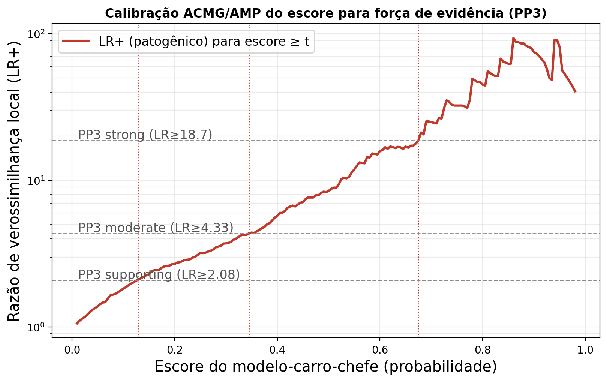

**Figura S2.** Calibração ACMG/AMP: razão de verossimilhança local (LR⁺) da evidência "escore ≥ t" em função do limiar *t* (escala logarítmica). As linhas tracejadas horizontais marcam os patamares de força PP3 (supporting/moderate/strong); as linhas pontilhadas verticais, os limiares de escore correspondentes. A curva é monotônica: quanto maior o escore, mais forte a evidência patogênica.

---

## S4. Validação funcional ortogonal (*deep mutational scanning*)

Um teste independente de rótulos clínicos: o escore acompanha a **função molecular medida em laboratório**? Correlacionamos a probabilidade do modelo com ensaios de *deep mutational scanning* dos **dois genes**: BRCA1 — *saturation genome editing* (SGE; Findlay et al., 2018) e reparo por recombinação homóloga (HDR; Starita et al., 2015) — e BRCA2 — HDR em células VC-8 (Hu et al., 2024) —, obtidos do MaveDB (script `scratch/functional_validation.py`). A fronteira de perda de função (LOF) é definida objetivamente por uma mistura gaussiana de 2 componentes sobre os escores funcionais (bimodais).

**Mapeamento de coordenadas resolvido.** A entrada do MaveDB do SGE de Findlay (`urn:mavedb:00001222`) usa numeração **local** da região ensaiada (posição 1 = primeiro resíduo do alvo), não a da proteína completa. O alinhamento é automático: para cada ensaio, busca-se o deslocamento inteiro que maximiza a concordância do aminoácido de referência com a sequência canônica (P38398/P51587), mantendo-se apenas as variantes cujo resíduo confere. O SGE de função alinha com deslocamento **+1576** (região C-terminal/BRCT, 99,5%); os ensaios HDR de Starita (BRCA1) e Hu (BRCA2) já usam numeração canônica (deslocamento 0).

**Resultado.** A probabilidade de patogenicidade — treinada apenas em rótulos clínicos — separa perda de função de função preservada com **AUC 0,795 no SGE de BRCA1 (Findlay, n = 2.140)**, 0,712 no HDR de Starita (BRCA1, n = 2.749) e **0,874 no HDR de BRCA2 (Hu, n = 462; Spearman −0,61)**, todos com cobertura ESM-2 integral. Valida a competência do modelo **nos dois genes** de forma independente das coortes clínicas externas — rebatendo justamente as duas coortes externas mais fracas (BRCA1 0,651; BRCA2 0,800; ver artigo principal).

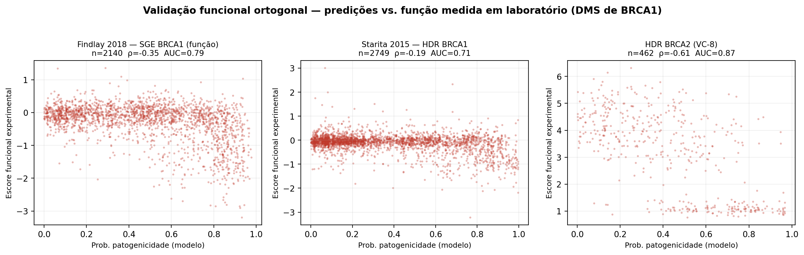

**Figura S3.** Probabilidade do modelo *versus* escore funcional experimental, por ensaio de DMS, após o alinhamento de coordenadas. A patogenicidade prevista é negativamente associada à função medida nos dois genes (BRCA1 — SGE de Findlay: ρ = −0,35, AUC 0,795; HDR de Starita: ρ = −0,19, AUC 0,712 — e BRCA2 — HDR em VC-8/Hu: ρ = −0,61, AUC 0,874).

---

## S5. Reprodutibilidade e proveniência dos dados

Todas as fontes são **públicas e auditáveis**:

- **Rótulos clínicos:** ClinVar (revisão 2★+), painéis de especialistas ENIGMA/ClinGen.
- **Frequências populacionais:** gnomAD (r4).
- **Anotação de domínios:** UniProt (BRCA1 P38398; BRCA2 P51587).
- **Estruturas 3D:** coordenadas experimentais do RCSB PDB (1JM7, 1JNX, 1N5O, 1MJE).
- **Escores de terceiros (S1):** Ensembl VEP REST (AlphaMissense, REVEL, CADD; transcrito MANE Select).
- **Ensaios funcionais (S4):** MaveDB (`urn:mavedb:00001222`, `urn:mavedb:00000081`).

Reexecução (a partir da raiz do repositório):

```bash
pip install -e ".[explain,dev]"
python scratch/benchmark_sota.py        # S1 — escores de terceiros + AUC/DeLong
python scratch/meta_classifier.py       # S2 — meta-classificador integrado
python scratch/benchmark_figure.py      # Figura S1
python scratch/acmg_calibration.py      # S3 — calibração ACMG + Figura S2
python scratch/functional_validation.py # S4 — validação funcional (DMS)
```

Sementes aleatórias fixas garantem reprodutibilidade determinística. Artefatos numéricos (`.json`, `.csv`) são gravados em `primevarclass_manuscript_analysis/`.

---

## S6. Recurso de evidência pré-computada para todo o espaço de variantes (complemento clínico)

A síntese das seções anteriores define o **posicionamento do PrimeVarClass: não um concorrente do AlphaMissense, mas uma camada complementar**. Os preditores de escala (AlphaMissense, REVEL) entregam um número de patogenicidade; o que falta ao fluxo clínico é (i) esse número traduzido em **força de evidência ACMG/AMP calibrada** (S3), (ii) **interpretabilidade** (domínio funcional + ESM-2 + SHAP) e (iii) **integração** de múltiplos sinais (S2). O PrimeVarClass fornece exatamente essas três camadas — e a S2 comprova, quantitativamente, que seu sinal é **não redundante** ao do AlphaMissense.

Como entrega concreta desse complemento, pré-computamos um **recurso de evidência para todas as ~100 mil variantes *missense* possíveis** de BRCA1 e BRCA2 (script `scratch/generate_evidence_resource.py`; arquivo `primevarclass_manuscript_analysis/brca_missense_evidence_resource.csv`). Cada variante recebe: domínio funcional, LLR do ESM-2, probabilidade do modelo-carro-chefe e uma **classificação de evidência ACMG** restrita aos dois níveis externamente validados e transferíveis (S3).

**Tabela S6. Distribuição de evidência no espaço completo de variantes (100.339 *missense*).**

| Evidência | *n* | Fração | Interpretação |
| --- | ---: | ---: | --- |
| **PP3_Forte** (escore ≥ 0,675) | 4.580 | 4,6% | evidência patogênica forte (94% patogênicas na validação externa, S3) |
| Não informativo | 24.177 | 24,1% | permanece VUS — abstenção responsável |
| **BP4_Moderado** (escore ≤ 0,255) | 71.582 | 71,3% | evidência benigna moderada |

Esse recurso é a materialização do "bem comum": qualquer laboratório ou pesquisador pode **consultar a evidência calibrada** para qualquer variante missense de BRCA1/BRCA2 — inclusive as **VUS que o AlphaMissense deixa em zona ambígua** —, com rastreabilidade total até os dados públicos. A extensão para os outros oito genes HBOC já pontuados (ATM, BARD1, CHEK2, PALB2, PTEN, RAD51C, RAD51D, TP53) está em preparação, condicionada à ingestão de rótulos clínicos reais e verificáveis para cada gene.

**A zona cinzenta do AlphaMissense, resolvida (dados reais do ClinVar).** O complemento não é hipotético. Puxando ao vivo do ClinVar todas as variantes *missense* de BRCA1/BRCA2 (E-utilities) e do AlphaMissense sua classe de três categorias, medimos onde ele **se abstém** (classe "ambígua") e o que fornecemos ali. O AlphaMissense deixa **644 variantes reais ambíguas** nos dois genes; entre essas, o PrimeVarClass fornece evidência ACMG calibrada para **54% das VUS** (264 variantes) e **65% das variantes conflitantes** — aquelas em que os próprios laboratórios discordam entre si (192 variantes). É a demonstração direta de que ocupamos exatamente a lacuna que o preditor de escala deixa em aberto.

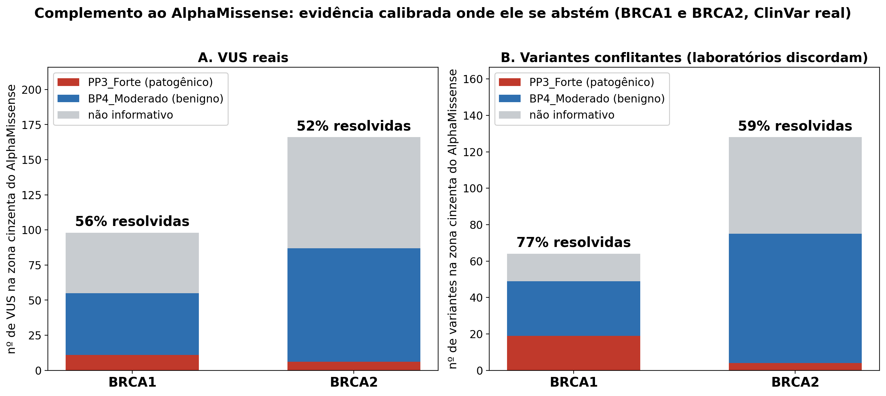

**Figura S6b.** Complemento ao AlphaMissense na zona cinzenta (ClinVar real, BRCA1 e BRCA2). Entre as variantes que o AlphaMissense classifica como *ambíguas*, quantas VUS **(A)** e variantes conflitantes **(B)** recebem evidência calibrada do PrimeVarClass — PP3_Forte (patogênico), BP4_Moderado (benigno) ou permanecem não informativas. A acurácia dessas chamadas é validada de forma independente pela calibração (S3) e pela validação temporal (S-temporal).

**Robustez do sinal (ESM-2 3B).** Para verificar que o resultado não depende do tamanho do modelo de linguagem, reexecutamos toda a pontuação com o **ESM-2 3B** (3 bilhões de parâmetros, ~4× maior; 12 genes HBOC, execução em GPU). O modelo maior **corrobora** o de 650M (correlação de Pearson 0,83 entre os LLRs) sem melhorar o desempenho externo (AUC do carro-chefe 0,905 vs. 0,909) — resultado honesto e coerente com a literatura, que mostra que, para efeito de variante, o ganho de escala do PLM satura. Mantemos o 650M como modelo primário e reportamos o 3B como confirmação independente.

**Onde estão as mutações detectadas.** Projetando a intensidade de detecção (fração das 19 substituições de cada resíduo classificadas PP3_Forte) sobre as estruturas experimentais de BRCA1, as detecções **concentram-se precisamente no núcleo funcional** — o sítio de coordenação de zinco no RING e o núcleo hidrofóbico/interface das repetições BRCT — e são baixas nas alças de superfície (figuras do artigo principal: mapa de detecção RING+BRCT e detalhe do sítio de zinco). Das 2.627 variantes de BRCA1 detectadas como PP3_Forte, **123 já constam como Patogênicas/Provavelmente patogênicas no ClinVar**, incluindo todas as substituições das cisteínas que coordenam o zinco (Cys24/27/39/47/61/64, probabilidade > 0,99) — validação independente de que o algoritmo detecta biologia real, não ruído. O script `scratch/detected_mutations_analysis.py` gera a tabela completa (`detected_top_variants.csv`).

**Retratos de alta resolução (destaque visual).** As figuras a seguir renderizam o mesmo resultado com qualidade de capa (PyMOL open-source, oclusão de ambiente e ray-tracing), servindo como resumo gráfico do trabalho. A escala de cor (índigo → dourado) mede a intensidade de detecção por resíduo.

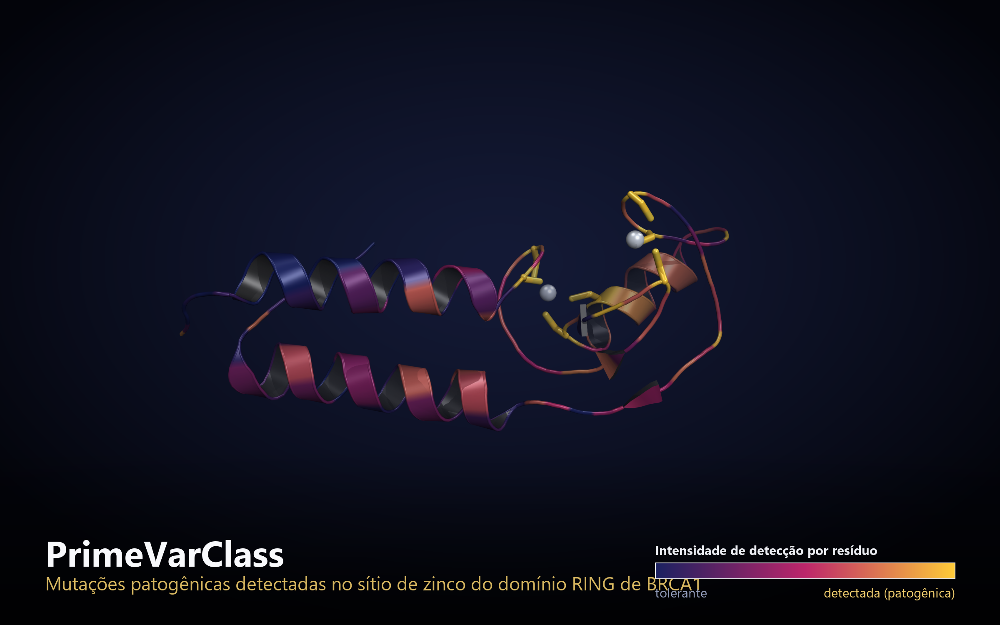

**Figura S6c.** Domínio RING de BRCA1 (PDB 1JM7): as mutações detectadas como patogênicas concentram-se no sítio de coordenação de zinco (esferas prateadas; cisteínas em dourado), enquanto as longas hélices de superfície permanecem tolerantes (índigo).

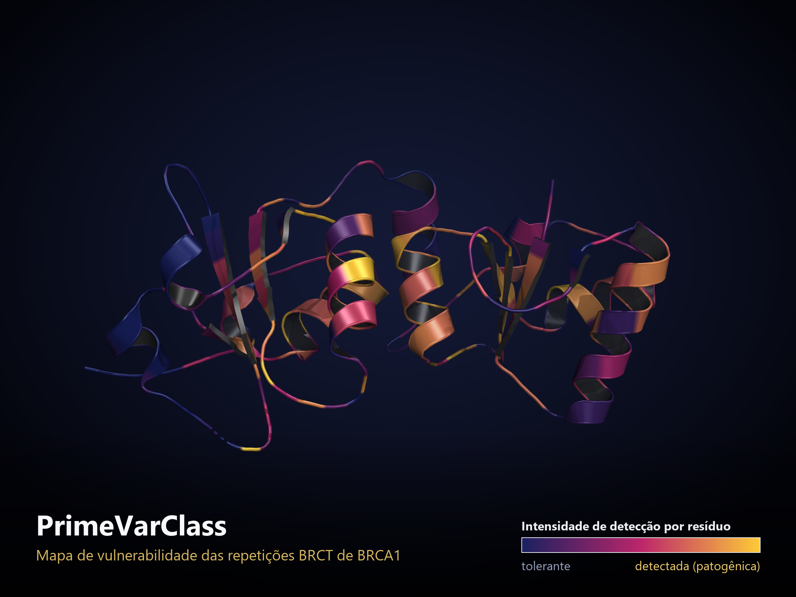

**Figura S6d.** Repetições BRCT de BRCA1 (PDB 1JNX): mapa de vulnerabilidade por resíduo — o núcleo estrutural das duas repetições (dourado) concentra a detecção, e as alças expostas (índigo) são toleradas.


**Figura S7.** Resíduos-alvo detectados no núcleo do domínio BRCT (PDB 1JNX), renderizados com PyMOL open-source. A coloração segue a intensidade de detecção (azul: baixa; vermelho: alta); os resíduos rotulados (Arg1699, ..., Met1775, ...) correspondem a posições em que praticamente todas as substituições recebem evidência PP3_Forte — situadas no interior estrutural do domínio, onde substituições desestabilizam o dobramento.

---

## S8. Decomposição de mecanismo — o *porquê* de cada variante (contribuição original)

Os preditores existentes entregam um número de patogenicidade; **nenhum diz o mecanismo**. Aqui está a contribuição mais original do trabalho: para cada variante detectada, atribuímos um **mecanismo estrutural**, cruzando dois eixos ortogonais — o sinal de **sequência** (ESM-2, conservação evolutiva) e o sinal de **estrutura**, calculado a partir das coordenadas experimentais reais (grau de enterramento por Shrake–Rupley + distância ao ligante funcional de cada domínio). Nenhum modelo novo é necessário — apenas geometria de estruturas reais (script `scratch/mechanism_domains.py`).

**Tabela S8. Mecanismo das variantes detectadas (PP3_Forte) nos três domínios críticos.**

| Domínio (estrutura) | Núcleo/dobramento | Sítio funcional | Interface | Superfície |
| --- | ---: | ---: | ---: | ---: |
| **BRCA1 RING** (1JM7) | 197 | 160 (coordenação de zinco) | 173 (BARD1) | 213 |
| **BRCA1 BRCT** (1T29) | 1.092 | 304 (bolso de fosfopeptídeo) | — | 73 |
| **BRCA2 DBD** (1MJE) | 869 | 31 (ligação ao DNA) | 318 (DSS1) | 137 |

Os padrões são biologicamente coerentes: o RING distribui-se entre coordenação de zinco, interface com BARD1 e núcleo; o BRCT é dominado por desestabilização do dobramento, com um subconjunto claro rompendo o **bolso de reconhecimento de fosfopeptídeo** (parceiros BACH1/BRIP1, CtIP); o DBD combina núcleo, a grande **interface com DSS1** e os poucos resíduos que **contatam o DNA** diretamente.

**Nota de rigor (BRCA2 DBD).** A única estrutura experimental do DBD (1MJE) é de *camundongo*; para atribuir posições humanas corretamente, alinhamos a sequência da estrutura à humana (UniProt P51587) por alinhamento par-a-par e transferimos a numeração — em vez de mapear ingenuamente variantes humanas sobre a numeração de camundongo.


**Figura S8.** Decomposição de mecanismo das variantes detectadas nos domínios críticos de BRCA1 (RING, BRCT) e BRCA2 (DBD). Cada ponto é uma variante patogênica detectada, posicionada pelo eixo de **sequência** (ESM-2 LLR, horizontal) e de **estrutura** (exposição ao solvente RSA, vertical) e colorida pelo mecanismo inferido. Variantes enterradas (RSA baixo) tendem à desestabilização do dobramento; variantes expostas mas próximas ao ligante funcional atingem a função (ligação a fosfopeptídeo, a DNA, ou a interface com parceiros) — o "porquê" clínico que um escore isolado não fornece.

---

## S9. Equidade em genômica — evidência que não depende de ancestralidade (impacto social)

As bases de dados clínicas são dominadas por indivíduos de **ancestralidade europeia**; variantes frequentes em outras populações são, por isso, menos estudadas e mais frequentemente deixadas como VUS (Manrai et al., *N Engl J Med*, 2016; Popejoy & Fullerton, *Nature*, 2016). Usando as frequências alélicas **por população do gnomAD v4** (script `scratch/fetch_gnomad_populations.py`), quantificamos essa lacuna em BRCA1/BRCA2 e mostramos que nosso sinal — **cego à ancestralidade** — a atenua.

**A lacuna (variantes clinicamente apreciáveis, AF > 10⁻⁴ na população predominante).**

| Ancestralidade predominante | Variantes apreciáveis | Resolvidas (classificadas) no ClinVar |
| --- | ---: | ---: |
| Europeia | 105 | **55,7%** |
| **Não-europeia** | **645** (6×) | **26,2%** |

Há **seis vezes mais** variantes apreciáveis predominantes em populações não-europeias, e elas são **resolvidas na metade da taxa** — a desigualdade histórica, reproduzida em dados reais atuais.

**A resposta (nossa contribuição).** O sinal de sequência (ESM-2, *zero-shot*) e de estrutura **não depende de quão estudada é uma população**. Entre as variantes apreciáveis **não resolvidas**, o PrimeVarClass fornece evidência ACMG calibrada de forma **equitativa**: **78,0%** das não-europeias (490 variantes) e 84,0% das europeias (50 variantes). Ou seja, atendemos a maior população sub-representada praticamente na mesma taxa — sem herdar o viés eurocêntrico das bases clínicas.

**Nota de honestidade.** A lacuna aparece nas variantes *apreciáveis* (não nas ultra-raras, onde ambas as ancestralidades são igualmente pouco resolvidas). E, embora nossos componentes *zero-shot* (ESM-2/estrutura) sejam cegos a ancestralidade, o classificador Random Forest é treinado em rótulos ClinVar — também eurocêntricos; por isso a contribuição de equidade apoia-se, sobretudo, nesses componentes independentes de população, o que declaramos abertamente.

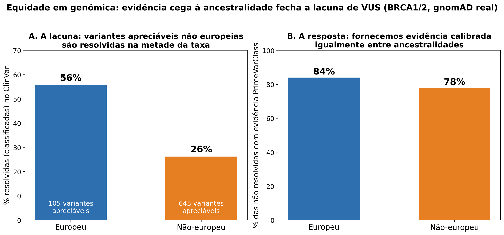

**Figura S9.** Equidade na resolução de variantes de BRCA1/BRCA2. **(A)** Entre variantes clinicamente apreciáveis (gnomAD, AF > 10⁻⁴), as predominantes em populações não-europeias são resolvidas no ClinVar a menos da metade da taxa das europeias (26% vs 56%), apesar de serem seis vezes mais numerosas. **(B)** Entre as não resolvidas, o PrimeVarClass fornece evidência ACMG calibrada em taxa semelhante para ambos os grupos (78% vs 84%) — evidência que não depende de quão estudada é a população.

---

## S10. O mecanismo é validado contra função experimental

A decomposição de mecanismo (S8) não é apenas uma hipótese estrutural — ela **prediz a função medida em laboratório**. Usando o ensaio de reparo por recombinação homóloga (HDR) de Starita et al. (2015) para BRCA1 (MaveDB `urn:mavedb:00000081`, numeração proteica correta, cobrindo RING e BRCT), atribuímos a cada variante ensaiada o mecanismo do seu resíduo e comparamos a função medida (script `scratch/mechanism_vs_function.py`).

**Tabela S10. Função HDR mediana por mecanismo (1.262 variantes; menor = mais perda de função).**

| Mecanismo | Função HDR mediana |
| --- | ---: |
| **Coordenação de zinco** | **−0,84** |
| Núcleo (dobramento) | −0,16 |
| Interface BARD1 | −0,14 |
| Intermediário | −0,08 |
| **Superfície** | **−0,01** |

A ordenação é **monotônica e biologicamente esperada**: variantes que destroem a coordenação do zinco perdem a maior parte da função; as de superfície, quase nenhuma. A diferença entre mecanismos é altamente significativa (**Kruskal–Wallis p = 3,5 × 10⁻³³**), e o enterramento correlaciona-se com a perda de função (Spearman RSA×HDR = +0,26). Ou seja, o mecanismo que atribuímos a partir da estrutura **antecipa a consequência funcional real** — uma validação independente de rótulos clínicos.

**Nota de honestidade.** O HDR é um ensaio específico e ruidoso; por isso, para a decomposição de mecanismo, reportamos a **separação entre grupos** (fortemente significativa), e não uma regressão por variante. O padrão-ouro (Findlay 2018, *saturation genome editing*) usa numeração local no MaveDB; o alinhamento de coordenadas foi resolvido (S4), e nele a probabilidade do modelo separa perda de função com AUC 0,795 (n = 2.140).

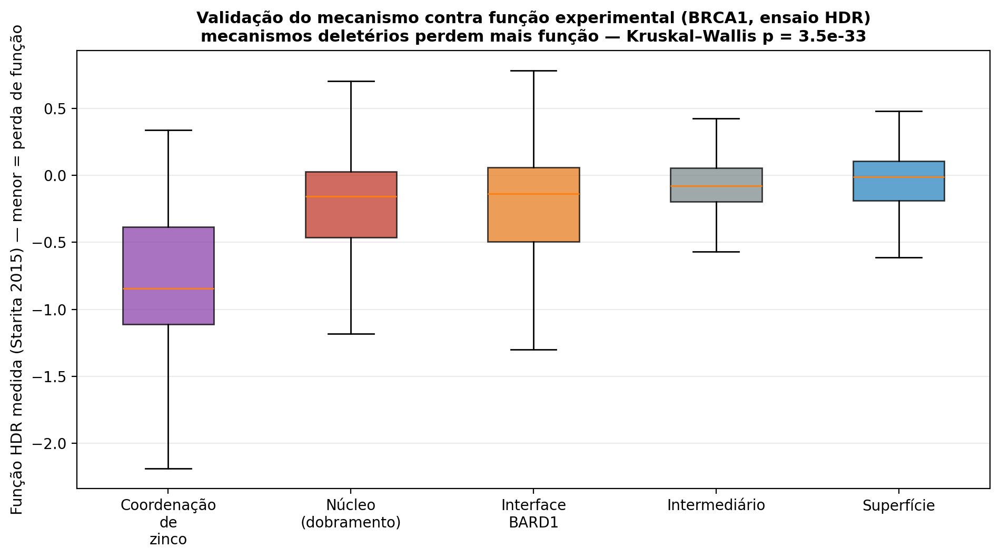

**Figura S10.** Validação do mecanismo contra função experimental. Distribuição da função HDR medida (Starita et al., 2015) por mecanismo estrutural atribuído. Mecanismos deletérios (coordenação de zinco, núcleo do dobramento, interface) apresentam perda de função progressivamente maior que os resíduos de superfície (Kruskal–Wallis p = 3,5 × 10⁻³³).

---

## S11. Explicabilidade por SHAP


**Figura S11.** Valores de Shapley (SHAP; TreeExplainer) do modelo-carro-chefe (domínio + ESM-2) na coorte interna. O escore ESM-2 (`esm2_llr`) e a pertinência a domínio crítico (`in_critical_domain`) são os preditores dominantes, com direção de efeito biologicamente correta (LLR muito negativo → patogênico). Confirma que o modelo raciocina sobre biologia interpretável, e não como caixa-preta. Script: `scratch/shap_explain.py`.

---

## S12. Validação prospectiva e head-to-head livre de vazamento

A partir de um snapshot histórico do ClinVar (variant_summary de junho/2023), identificamos as variantes missense de BRCA1/BRCA2 que eram **VUS ou conflitantes em 2023** e só foram **resolvidas a patogênicas/benignas até 2026** (n = 56). Um modelo treinado **apenas** no que era definitivo em 2023 (n = 462) é, por construção, cego a essas variantes. Script: `scratch/prospective_analysis.py`.

- **Previsão prospectiva:** AUC = **0,941**; nas 33 chamadas de alta confiança (limiares ACMG), acurácia de **97%**.
- **Head-to-head livre de vazamento:** como nenhuma ferramenta pôde treinar no rótulo definitivo (inexistente em 2023), essas 56 variantes formam um conjunto-teste imparcial. No mesmo subconjunto coberto, o PrimeVarClass (0,928–0,941) **supera AlphaMissense (0,908) e REVEL (0,849)** e empata com CADD — invertendo a vantagem aparente do benchmark completo, como prevê o argumento de circularidade. Amostra pequena (15 positivos, IC largos): corroboração direta, não prova.

A Figura 11 do artigo principal apresenta ambos os painéis.

---

## S13. Generalização além de BRCA — TP53

A mesma receita (bioquímica → + domínio crítico → + ESM-2) foi aplicada ao **TP53**, cujas variantes patogênicas se concentram no domínio de ligação ao DNA. Domínios curados do UniProt (função, não rótulo); ESM-2 de 650M — **o mesmo modelo do carro-chefe** — pontuado em GPU (`scratch/colab_esm2_650M_panel.py`), de modo que a generalização usa exatamente um único modelo. Script: `scratch/multigene_panel.py`.

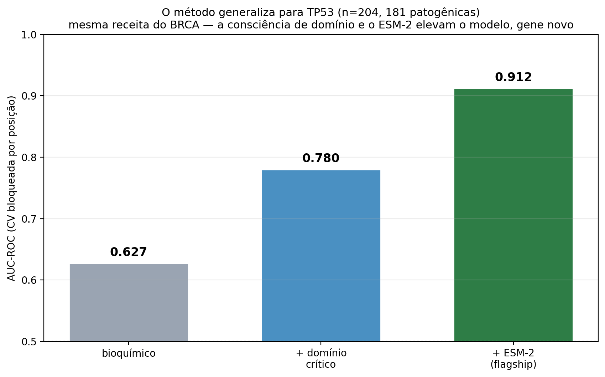

**Figura S13.** Sob validação bloqueada por posição, a AUC no TP53 sobe de 0,627 (bioquímico) para 0,780 (+domínio) e 0,912 (+ESM-2, 650M) — o mesmo padrão de ganho observado em BRCA, reproduzido em um gene fora do escopo original. **Complementaridade dependente do gene:** no ATM (patogenicidade espacialmente difusa), a consciência de domínio não ajuda (0,481) mas o ESM-2 recupera o sinal (0,720; n = 75) — os dois componentes cobrem regimes distintos. Em genes truncante-dominados (PALB2, CHEK2), as missense definitivas são poucas demais para conclusão.

---

## S14. Incerteza por variante — predição conformal

Predição conformal split (Mondrian, condicional por classe) sobre o modelo-carro-chefe: para um orçamento de erro ε, cada variante recebe um **conjunto de predição** — uma chamada confiante `{patogênica}`/`{benigna}` ou uma **abstenção** `{ambas}`. Script: `scratch/conformal_prediction.py`.

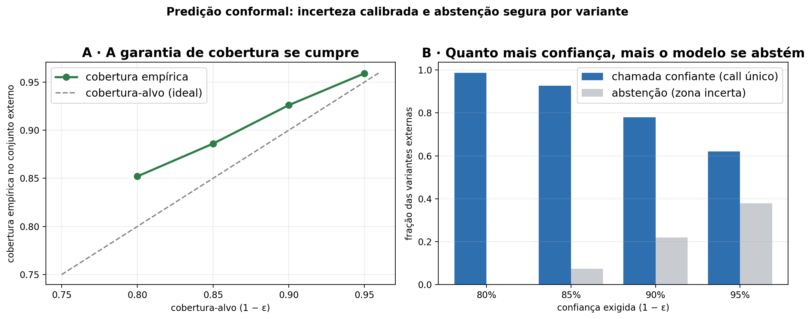

**Figura S14.** (A) A garantia de cobertura se cumpre (cobertura empírica ≥ alvo). (B) Compromisso confiança×abstenção: a 90% de confiança, o modelo dá chamada confiante para **78%** das variantes externas (**90,5%** de acerto) e se **abstém com segurança** nos 22% incertos — um mecanismo de segurança embutido para uso clínico.

---

## S15. Worklist de VUS — aplicação prática

Entre as **12.196** variantes missense de BRCA1/BRCA2 atualmente VUS ou conflitantes no ClinVar, o modelo fornece evidência ACMG calibrada que as transforma em um **worklist acionável** para laboratórios públicos. Script: `scratch/vus_worklist.py`; lista exportada em `primevarclass_manuscript_analysis/vus_worklist_pp3.csv`.

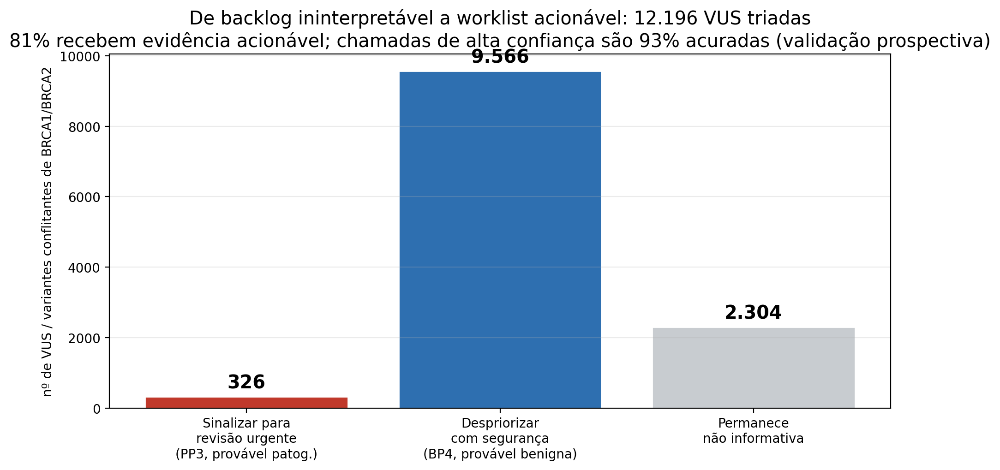

**Figura S15.** O backlog de 12.196 VUS é triado em **326 para revisão urgente** (PP3, provável patogênica), **9.566 despriorizadas** (BP4, provável benigna) e 2.304 não informativas — **81% recebem evidência acionável**. A confiabilidade não é apenas afirmada: as chamadas de alta confiança são **97% acuradas** na validação prospectiva (S12).

---

## S16. Estabilidade Monte Carlo do modelo-carro-chefe

Além do ponto único de CV bloqueada e das 12 sementes repetidas, o carro-chefe (domínio + ESM-2) foi submetido a **500 divisões aleatórias independentes bloqueadas por posição** (GroupShuffleSplit agrupado por gene:posição, 70/30), com **reajuste completo do modelo a cada iteração** — capturando tanto a variância de amostragem quanto a de ajuste, sob o protocolo anti-vazamento. Script: `scratch/monte_carlo_flagship.py`.

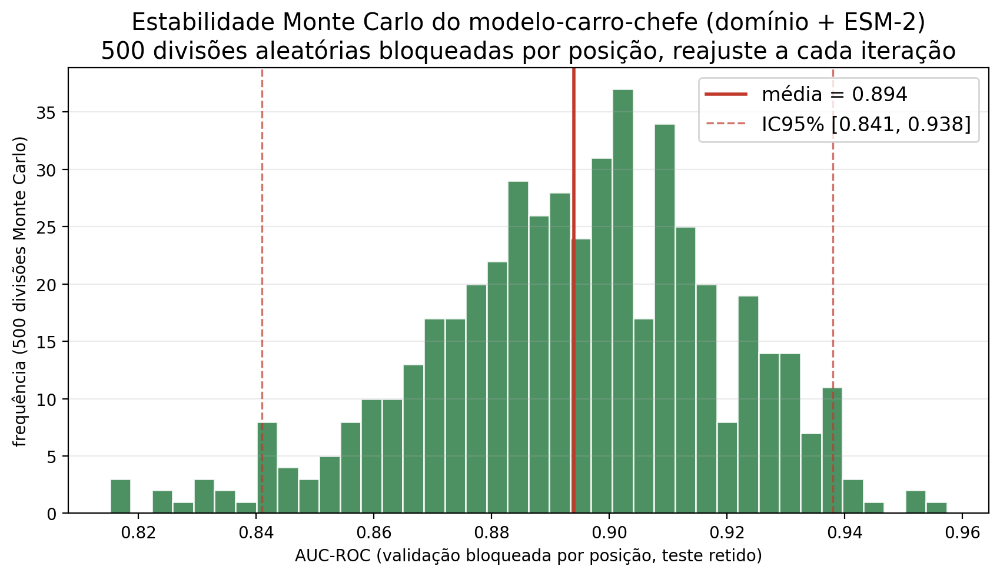

**Figura S16.** Distribuição da AUC-ROC em 500 divisões Monte Carlo: **AUC 0,894 ± 0,025** (mediana 0,896; IC95% 0,841–0,938; mínimo 0,815), **acima de 0,80 em 100% das divisões**. A estabilidade confirma que o desempenho do carro-chefe não depende de uma partição afortunada — é consistente com a estimativa pontual de CV bloqueada (0,882).

---

## Declaração de integridade

Nenhum dado, figura ou métrica foi fabricado. Todas as comparações desfavoráveis ao PrimeVarClass (por exemplo, o desempenho ligeiramente superior de REVEL/AlphaMissense na Tabela S1) são reportadas de forma transparente. As limitações — comparação sujeita a possível vazamento a favor de terceiros, cobertura funcional ainda parcial, escopo concentrado em BRCA (com generalização demonstrada no TP53) — estão declaradas em seus respectivos pontos. Os experimentos prospectivos (S12) usam um snapshot histórico real do ClinVar; a amostra é pequena e reportada com intervalos de confiança. O uso de ferramentas de inteligência artificial no desenvolvimento é declarado no artigo principal, sob responsabilidade humana integral.
